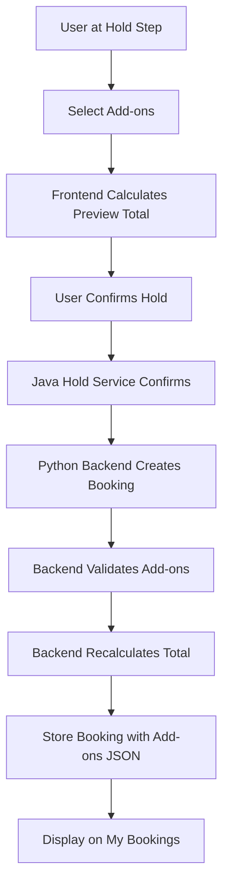

# Implementation Plan: Issue #33 - Checkout Add-ons

**Issue:** [#33 - Checkout add-ons (baggage, meals, Wi-Fi, insurance, zero-G)](https://github.com/IBM/galaxium-travels/issues/33)

**Estimated Time:** ~2 hours

**Status:** Ready for implementation

---

## Overview

Add a checkout upsell flow where customers can select add-ons (extra baggage, meals, Wi-Fi, insurance, zero-G experiences) during the hold confirmation step. This addresses the gap where real travel sites have 70% upsell opportunities, but Galaxium Travels currently has 0%.

### Key Design Decisions

1. **Integration Point:** Add-ons are selected during hold confirmation (step 3 of [`BookingModal.tsx`](booking_system_frontend/src/components/bookings/BookingModal.tsx:366)), NOT as a separate step
2. **Storage:** Add-ons stored as JSON column on [`Booking`](booking_system_backend/models.py:31) model
3. **Validation:** Backend recomputes total and validates against tampering
4. **Scope:** Add-ons apply to entire booking (not per-passenger)
5. **Java Service:** No changes needed to inventory hold service

---

## Architecture Flow



---

## Implementation Steps

### Phase 1: Backend Schema & Models (30 min)

#### 1.1 Update Database Model
**File:** [`booking_system_backend/models.py`](booking_system_backend/models.py:31)

Add JSON column to Booking model:
```python
from sqlalchemy import Column, Integer, String, ForeignKey, JSON

class Booking(Base):
    __tablename__ = 'bookings'
    booking_id = Column(Integer, primary_key=True, index=True, autoincrement=True)
    user_id = Column(Integer, ForeignKey('users.user_id'), nullable=False)
    flight_id = Column(Integer, ForeignKey('flights.flight_id'), nullable=False)
    status = Column(String, nullable=False)
    booking_time = Column(String, nullable=False)
    seat_class = Column(String, nullable=False, default='economy')
    price_paid = Column(Integer, nullable=False)
    addons = Column(JSON, nullable=True)  # NEW: Store selected add-ons
```

#### 1.2 Update Pydantic Schemas
**File:** [`booking_system_backend/schemas.py`](booking_system_backend/schemas.py:51)

Add add-ons types and update schemas:
```python
from typing import Optional, Literal, List

class AddOn(BaseModel):
    id: str
    name: str
    price: int
    selected: bool = False

class BookingRequest(BaseModel):
    user_id: int
    name: str
    flight_id: int
    seat_class: SeatClass = 'economy'
    addons: Optional[List[AddOn]] = None  # NEW

class BookingOut(BaseModel):
    booking_id: int
    user_id: int
    flight_id: int
    status: str
    booking_time: str
    seat_class: str
    price_paid: int
    addons: Optional[List[AddOn]] = None  # NEW
```

#### 1.3 Update Booking Service Logic
**File:** [`booking_system_backend/services/booking.py`](booking_system_backend/services/booking.py:15)

Modify [`book_flight()`](booking_system_backend/services/booking.py:15) to:
1. Accept `addons` parameter
2. Validate add-on IDs against catalog
3. Recalculate total price (base + add-ons)
4. Store add-ons as JSON

```python
def book_flight(db: Session, user_id: int, name: str, flight_id: int, 
                seat_class: SeatClass = 'economy', addons: list = None) -> BookingOut | ErrorResponse:
    # ... existing validation ...
    
    # Calculate base price
    base_price = int(flight.base_price * SEAT_CLASS_MULTIPLIERS[seat_class])
    
    # Validate and calculate add-ons total
    addons_total = 0
    validated_addons = []
    if addons:
        from .addons import ADDONS_CATALOG  # Import catalog
        for addon in addons:
            if addon.get('selected'):
                catalog_item = next((a for a in ADDONS_CATALOG if a['id'] == addon['id']), None)
                if not catalog_item:
                    return ErrorResponse(
                        error="Invalid add-on",
                        error_code="INVALID_ADDON",
                        details=f"Add-on '{addon['id']}' not found in catalog"
                    )
                # Validate price hasn't been tampered with
                if addon.get('price') != catalog_item['price']:
                    return ErrorResponse(
                        error="Price tampering detected",
                        error_code="PRICE_TAMPERING",
                        details=f"Add-on price mismatch for '{addon['id']}'"
                    )
                addons_total += catalog_item['price']
                validated_addons.append(catalog_item)
    
    total_price = base_price + addons_total
    
    # Create booking with add-ons
    new_booking = Booking(
        user_id=user_id,
        flight_id=flight_id,
        status="booked",
        booking_time=datetime.utcnow().isoformat(),
        seat_class=seat_class,
        price_paid=total_price,
        addons=validated_addons if validated_addons else None
    )
    # ... rest of logic ...
```

#### 1.4 Create Add-ons Catalog Service
**File:** `booking_system_backend/services/addons.py` (NEW)

```python
# Static catalog of available add-ons
ADDONS_CATALOG = [
    {
        "id": "extra_cargo",
        "name": "Extra Cargo Allowance",
        "description": "Additional 20kg cargo allowance for moon rocks and souvenirs",
        "price": 150,
        "icon": "💼"
    },
    {
        "id": "gourmet_meal",
        "name": "Gourmet Space Meal",
        "description": "Chef-prepared zero-gravity cuisine with asteroid-aged wine",
        "price": 85,
        "icon": "🍽️"
    },
    {
        "id": "wifi",
        "name": "Interstellar Wi-Fi",
        "description": "High-speed quantum-entangled connectivity throughout your journey",
        "price": 45,
        "icon": "📡"
    },
    {
        "id": "insurance",
        "name": "Cosmic Travel Insurance",
        "description": "Comprehensive coverage including meteor strikes and alien encounters",
        "price": 200,
        "icon": "🛡️"
    },
    {
        "id": "zero_g",
        "name": "Zero-G Experience Package",
        "description": "30-minute guided zero-gravity experience with certified instructor",
        "price": 500,
        "icon": "🚀"
    },
    {
        "id": "window_seat",
        "name": "Window Seat Upgrade",
        "description": "Guaranteed panoramic viewport for Earth/Mars views",
        "price": 120,
        "icon": "🪟"
    },
    {
        "id": "lounge_access",
        "name": "Spaceport Lounge Access",
        "description": "Pre-departure access to luxury orbital lounge with anti-gravity bar",
        "price": 95,
        "icon": "👑"
    }
]

def get_addons_catalog():
    """Return the static add-ons catalog."""
    return ADDONS_CATALOG
```

#### 1.5 Update REST API Endpoint
**File:** [`booking_system_backend/server.py`](booking_system_backend/server.py:1)

Add endpoint to fetch add-ons catalog and update internal booking endpoint:

```python
@app.get("/addons", response_model=list)
def get_addons():
    """Get available add-ons catalog."""
    from services.addons import get_addons_catalog
    return get_addons_catalog()

@app.post("/internal/bookings/from-hold")
def create_booking_from_hold(request: dict):
    # ... existing code ...
    # Extract addons from request if present
    addons = request.get('addons', None)
    result = booking.book_flight(
        db, 
        user_id, 
        traveler_name, 
        flight_id, 
        seat_class,
        addons=addons  # Pass add-ons
    )
    # ... rest of logic ...
```

---

### Phase 2: Frontend Data & Types (20 min)

#### 2.1 Create Add-ons Data File
**File:** `booking_system_frontend/src/data/addOns.ts` (NEW)

```typescript
export interface AddOn {
  id: string;
  name: string;
  description: string;
  price: number;
  icon: string;
}

export const ADDONS_CATALOG: AddOn[] = [
  {
    id: 'extra_cargo',
    name: 'Extra Cargo Allowance',
    description: 'Additional 20kg cargo allowance for moon rocks and souvenirs',
    price: 150,
    icon: '💼'
  },
  {
    id: 'gourmet_meal',
    name: 'Gourmet Space Meal',
    description: 'Chef-prepared zero-gravity cuisine with asteroid-aged wine',
    price: 85,
    icon: '🍽️'
  },
  {
    id: 'wifi',
    name: 'Interstellar Wi-Fi',
    description: 'High-speed quantum-entangled connectivity throughout your journey',
    price: 45,
    icon: '📡'
  },
  {
    id: 'insurance',
    name: 'Cosmic Travel Insurance',
    description: 'Comprehensive coverage including meteor strikes and alien encounters',
    price: 200,
    icon: '🛡️'
  },
  {
    id: 'zero_g',
    name: 'Zero-G Experience Package',
    description: '30-minute guided zero-gravity experience with certified instructor',
    price: 500,
    icon: '🚀'
  },
  {
    id: 'window_seat',
    name: 'Window Seat Upgrade',
    description: 'Guaranteed panoramic viewport for Earth/Mars views',
    price: 120,
    icon: '🪟'
  },
  {
    id: 'lounge_access',
    name: 'Spaceport Lounge Access',
    description: 'Pre-departure access to luxury orbital lounge with anti-gravity bar',
    price: 95,
    icon: '👑'
  }
];
```

#### 2.2 Update TypeScript Types
**File:** [`booking_system_frontend/src/types/index.ts`](booking_system_frontend/src/types/index.ts:1)

```typescript
export interface AddOn {
  id: string;
  name: string;
  description: string;
  price: number;
  icon: string;
}

export interface Booking {
  booking_id: number;
  user_id: number;
  flight_id: number;
  status: 'booked' | 'cancelled' | 'completed';
  booking_time: string;
  seat_class: SeatClass;
  price_paid: number;
  addons?: AddOn[];  // NEW
}
```

---

### Phase 3: Frontend UI Components (50 min)

#### 3.1 Update BookingModal - Add Add-ons Selection
**File:** [`booking_system_frontend/src/components/bookings/BookingModal.tsx`](booking_system_frontend/src/components/bookings/BookingModal.tsx:366)

Modify the hold step (line 366) to include add-ons selection:

```typescript
import { ADDONS_CATALOG } from '../../data/addOns';
import type { AddOn } from '../../types';

// Add state for selected add-ons
const [selectedAddons, setSelectedAddons] = useState<Set<string>>(new Set());

// Calculate total with add-ons
const addonsTotal = Array.from(selectedAddons).reduce((sum, id) => {
  const addon = ADDONS_CATALOG.find(a => a.id === id);
  return sum + (addon?.price || 0);
}, 0);

const totalWithAddons = (quote?.totalPrice || 0) + addonsTotal;

// Toggle add-on selection
const toggleAddon = (addonId: string) => {
  setSelectedAddons(prev => {
    const next = new Set(prev);
    if (next.has(addonId)) {
      next.delete(addonId);
    } else {
      next.add(addonId);
    }
    return next;
  });
};

// Update renderHoldStep to include add-ons UI
const renderHoldStep = () => (
  <div className="space-y-6">
    {/* Existing hold ID and timer ... */}
    
    {/* NEW: Add-ons Section */}
    <div className="glass-card p-4 bg-white/5">
      <h4 className="text-sm font-semibold text-star-white mb-3">
        ✨ Enhance Your Journey
      </h4>
      <div className="space-y-2">
        {ADDONS_CATALOG.map(addon => (
          <label
            key={addon.id}
            className="flex items-start gap-3 p-3 rounded-lg border border-white/10 
                       hover:border-alien-green/30 hover:bg-white/5 cursor-pointer transition-all"
          >
            <input
              type="checkbox"
              checked={selectedAddons.has(addon.id)}
              onChange={() => toggleAddon(addon.id)}
              className="mt-1"
            />
            <div className="flex-1">
              <div className="flex items-center gap-2 mb-1">
                <span className="text-lg">{addon.icon}</span>
                <span className="text-sm font-medium text-star-white">
                  {addon.name}
                </span>
                <span className="text-sm font-bold text-alien-green ml-auto">
                  {formatCurrency(addon.price)}
                </span>
              </div>
              <p className="text-xs text-star-white/60">{addon.description}</p>
            </div>
          </label>
        ))}
      </div>
    </div>

    {/* Updated total display */}
    <div className="space-y-2">
      <div className="flex items-center justify-between p-3 rounded-lg bg-white/5">
        <span className="text-sm text-star-white/70">Base Fare</span>
        <span className="text-star-white font-medium">
          {formatCurrency(quote?.totalPrice || 0)}
        </span>
      </div>
      {addonsTotal > 0 && (
        <div className="flex items-center justify-between p-3 rounded-lg bg-white/5">
          <span className="text-sm text-star-white/70">Add-ons</span>
          <span className="text-alien-green font-medium">
            +{formatCurrency(addonsTotal)}
          </span>
        </div>
      )}
      <div className="flex items-center justify-between p-4 rounded-xl bg-cosmic-gradient">
        <div className="flex items-center gap-2">
          <DollarSign className="text-white" size={20} />
          <span className="text-white font-semibold">Total</span>
        </div>
        <span className="text-xl font-bold text-white">
          {formatCurrency(totalWithAddons)}
        </span>
      </div>
    </div>

    {/* Existing buttons ... */}
  </div>
);
```

#### 3.2 Update API Service - Pass Add-ons to Backend
**File:** [`booking_system_frontend/src/services/api.ts`](booking_system_frontend/src/services/api.ts:1)

Update [`confirmHold()`](booking_system_frontend/src/services/api.ts:1) to accept and pass add-ons:

```typescript
export const confirmHold = async (
  holdId: string, 
  selectedAddons?: string[]
): Promise<Hold> => {
  const body: any = {};
  
  if (selectedAddons && selectedAddons.length > 0) {
    // Convert selected IDs to full add-on objects
    const addons = ADDONS_CATALOG
      .filter(a => selectedAddons.includes(a.id))
      .map(a => ({ ...a, selected: true }));
    body.addons = addons;
  }

  const response = await fetch(`${JAVA_API_URL}/holds/${holdId}/confirm`, {
    method: 'POST',
    headers: { 'Content-Type': 'application/json' },
    body: JSON.stringify(body)
  });
  
  // ... rest of logic ...
};
```

#### 3.3 Update Hold Confirmation Handler
**File:** [`booking_system_frontend/src/components/bookings/BookingModal.tsx`](booking_system_frontend/src/components/bookings/BookingModal.tsx:198)

Update [`handleConfirmHold()`](booking_system_frontend/src/components/bookings/BookingModal.tsx:198):

```typescript
const handleConfirmHold = async () => {
  if (!hold || !user) return;

  setIsLoading(true);
  try {
    const selectedAddonIds = Array.from(selectedAddons);
    const confirmed = await confirmHold(hold.holdId, selectedAddonIds);
    removeHold(user.user_id, hold.holdId);
    toast.success(
      `Booking confirmed! Reference: #${confirmed.externalBookingReference}`
    );
    onSuccess();
    onClose();
  } catch {
    toast.error('Failed to confirm booking');
  } finally {
    setIsLoading(false);
  }
};
```

---

### Phase 4: Display Add-ons on My Bookings (20 min)

#### 4.1 Update BookingCard Component
**File:** [`booking_system_frontend/src/components/bookings/BookingCard.tsx`](booking_system_frontend/src/components/bookings/BookingCard.tsx:1)

Add add-ons display section:

```typescript
{booking.addons && booking.addons.length > 0 && (
  <div className="mt-3 pt-3 border-t border-white/10">
    <p className="text-xs text-star-white/60 mb-2">Add-ons:</p>
    <div className="flex flex-wrap gap-2">
      {booking.addons.map(addon => (
        <span
          key={addon.id}
          className="text-xs px-2 py-1 rounded-full bg-alien-green/10 
                     border border-alien-green/30 text-alien-green"
        >
          {addon.icon} {addon.name}
        </span>
      ))}
    </div>
  </div>
)}
```

---

### Phase 5: Java Service Integration (10 min)

#### 5.1 Update Java Hold Confirmation
**File:** [`inventory_hold_service/src/main/java/com/galaxium/holdservice/client/PythonBackendClient.java`](inventory_hold_service/src/main/java/com/galaxium/holdservice/client/PythonBackendClient.java:32)

Ensure the Java service passes add-ons to Python backend when confirming:

```java
public BookingResponse createBookingFromHold(Hold hold, List<Map<String, Object>> addons) {
    Map<String, Object> request = new HashMap<>();
    request.put("user_id", hold.getTravelerId());
    request.put("traveler_name", hold.getTravelerName());
    request.put("flight_id", hold.getFlightId());
    request.put("seat_class", hold.getSeatClass());
    
    if (addons != null && !addons.isEmpty()) {
        request.put("addons", addons);  // NEW: Pass add-ons
    }
    
    // ... rest of logic ...
}
```

Update [`HoldController.java`](inventory_hold_service/src/main/java/com/galaxium/holdservice/api/HoldController.java:1) to accept add-ons in request body:

```java
@PostMapping("/{holdId}/confirm")
public ResponseEntity<Hold> confirmHold(
    @PathVariable String holdId,
    @RequestBody(required = false) Map<String, Object> requestBody
) {
    List<Map<String, Object>> addons = null;
    if (requestBody != null && requestBody.containsKey("addons")) {
        addons = (List<Map<String, Object>>) requestBody.get("addons");
    }
    Hold confirmed = holdService.confirmHold(holdId, addons);
    return ResponseEntity.ok(confirmed);
}
```

---

## Testing Checklist

### Backend Tests
- [ ] Add-ons catalog endpoint returns 7 items
- [ ] Booking with valid add-ons succeeds
- [ ] Booking with invalid add-on ID fails with error
- [ ] Price tampering detection works (modified price rejected)
- [ ] Booking without add-ons still works
- [ ] Add-ons stored correctly in database as JSON
- [ ] Total price calculation includes add-ons

### Frontend Tests
- [ ] Add-ons section appears in hold step
- [ ] All 7 add-ons display with correct prices
- [ ] Checkbox selection works
- [ ] Total updates live when add-ons toggled
- [ ] Confirm booking sends selected add-ons
- [ ] Add-ons display on My Bookings page
- [ ] Booking without add-ons still works

### Integration Tests
- [ ] End-to-end flow: select add-ons → confirm → see on My Bookings
- [ ] Java service passes add-ons to Python backend
- [ ] Backend validates and stores add-ons correctly

---

## Database Migration

Since we're adding a new column, you'll need to handle migration:

**Option 1: Drop and recreate (dev only)**
```bash
# Delete existing database
rm booking_system_backend/bookings.db
# Restart backend - it will recreate with new schema
```

**Option 2: Manual migration (production)**
```sql
ALTER TABLE bookings ADD COLUMN addons JSON;
```

---

## Acceptance Criteria Mapping

- [x] **Extras step appears between hold and payment steps** → Integrated into hold step (step 3)
- [x] **At least 5 add-ons available** → 7 add-ons defined in catalog
- [x] **Total updates live as add-ons are toggled** → React state updates total
- [x] **Selected add-ons persist with booking** → Stored in JSON column
- [x] **Backend recomputes total and rejects tampering** → Price validation in service layer
- [x] **Add-ons visible on My Trip page** → BookingCard displays add-ons

---

## Files to Create/Modify

### New Files (2)
1. `booking_system_backend/services/addons.py`
2. `booking_system_frontend/src/data/addOns.ts`

### Modified Files (9)
1. [`booking_system_backend/models.py`](booking_system_backend/models.py:31) - Add JSON column
2. [`booking_system_backend/schemas.py`](booking_system_backend/schemas.py:51) - Add AddOn types
3. [`booking_system_backend/services/booking.py`](booking_system_backend/services/booking.py:15) - Add validation logic
4. [`booking_system_backend/server.py`](booking_system_backend/server.py:1) - Add catalog endpoint
5. [`booking_system_frontend/src/types/index.ts`](booking_system_frontend/src/types/index.ts:20) - Add AddOn interface
6. [`booking_system_frontend/src/components/bookings/BookingModal.tsx`](booking_system_frontend/src/components/bookings/BookingModal.tsx:366) - Add UI
7. [`booking_system_frontend/src/services/api.ts`](booking_system_frontend/src/services/api.ts:1) - Pass add-ons
8. [`booking_system_frontend/src/components/bookings/BookingCard.tsx`](booking_system_frontend/src/components/bookings/BookingCard.tsx:1) - Display add-ons
9. Java service files (2 files) - Pass add-ons through

---

## Notes

- **No separate step:** Add-ons integrated into existing hold step per issue notes
- **Static catalog:** No database table for add-ons (future enhancement)
- **Whole booking:** Add-ons apply to entire booking, not per-passenger
- **Price validation:** Backend is authoritative, frontend is preview only
- **Java service:** Minimal changes, just passes data through to Python

---

## Next Steps

1. Review this plan with stakeholders
2. Switch to Code mode to implement
3. Test each phase incrementally
4. Update documentation
5. Close issue #33