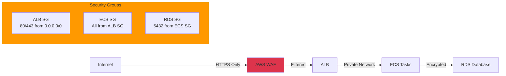

# AWS Infrastructure Architecture

## Mermaid Diagram

```mermaid
graph TB
    User((User))
    
    subgraph AWS["AWS Cloud Infrastructure"]
        ALB[ALB<br/>Application Load Balancer]
        
        subgraph ECS["ECS - Elastic Container Service"]
            Frontend[Frontend<br/>Container]
            Backend[Backend<br/>Container]
        end
        
        subgraph RDS["RDS - Relational Database Service"]
            Database[(Database)]
        end
        
        Terraform[Terraform<br/>Infrastructure as Code]
    end
    
    User -->|HTTPS| ALB
    ALB --> Frontend
    Frontend --> Backend
    Backend --> Database
    Terraform -.->|manages| AWS
    
    style ALB fill:#ff9900
    style ECS fill:#333
    style Frontend fill:#666
    style Backend fill:#666
    style RDS fill:#527FFF
    style Database fill:#527FFF
    style Terraform fill:#5C4EE5
    style AWS fill:#232F3E,stroke:#FF9900,stroke-width:3px
```

## Architecture Components

### 1. Application Load Balancer (ALB)
- **Purpose:** Entry point for all user traffic
- **Features:**
  - SSL/TLS termination
  - Path-based routing
  - Health checks
  - Auto-scaling integration
- **Configuration:**
  - Listener on port 443 (HTTPS)
  - Target groups for frontend and backend
  - Security group: Allow 80/443 from internet

### 2. ECS (Elastic Container Service)
- **Purpose:** Container orchestration platform
- **Launch Type:** Fargate (serverless)
- **Services:**
  - **Frontend Service:**
    - React application
    - Nginx web server
    - Port 80
    - 2 tasks (high availability)
  - **Backend Service:**
    - FastAPI application
    - Uvicorn/Gunicorn server
    - Port 8080
    - 2 tasks (high availability)
- **Features:**
  - Auto-scaling based on CPU/memory
  - Rolling deployments
  - CloudWatch logging
  - Service discovery

### 3. RDS (Relational Database Service)
- **Purpose:** Managed PostgreSQL database
- **Configuration:**
  - Instance type: db.t3.micro (production: db.t3.small+)
  - Multi-AZ deployment for high availability
  - Automated backups (7-day retention)
  - Encryption at rest
- **Security:**
  - Private subnet only
  - Security group: Allow 5432 from ECS only
  - No public access

### 4. Terraform
- **Purpose:** Infrastructure as Code (IaC)
- **Manages:**
  - All AWS resources
  - Network configuration
  - Security policies
  - Service definitions
- **Benefits:**
  - Version controlled infrastructure
  - Reproducible deployments
  - Easy rollback
  - Documentation as code

## Network Architecture

```mermaid
graph TB
    subgraph VPC["VPC - 10.0.0.0/16"]
        subgraph PublicSubnet1["Public Subnet 1<br/>10.0.1.0/24<br/>AZ-1"]
            ALB1[ALB]
            NAT1[NAT Gateway]
        end
        
        subgraph PublicSubnet2["Public Subnet 2<br/>10.0.2.0/24<br/>AZ-2"]
            ALB2[ALB]
            NAT2[NAT Gateway]
        end
        
        subgraph PrivateSubnet1["Private Subnet 1<br/>10.0.11.0/24<br/>AZ-1"]
            ECS1[ECS Tasks]
        end
        
        subgraph PrivateSubnet2["Private Subnet 2<br/>10.0.12.0/24<br/>AZ-2"]
            ECS2[ECS Tasks]
        end
        
        subgraph DatabaseSubnet1["Database Subnet 1<br/>10.0.21.0/24<br/>AZ-1"]
            RDS1[(RDS Primary)]
        end
        
        subgraph DatabaseSubnet2["Database Subnet 2<br/>10.0.22.0/24<br/>AZ-2"]
            RDS2[(RDS Standby)]
        end
        
        IGW[Internet Gateway]
    end
    
    Internet((Internet))
    
    Internet --> IGW
    IGW --> ALB1
    IGW --> ALB2
    ALB1 --> ECS1
    ALB2 --> ECS2
    ECS1 --> NAT1
    ECS2 --> NAT2
    NAT1 --> IGW
    NAT2 --> IGW
    ECS1 --> RDS1
    ECS2 --> RDS1
    RDS1 -.->|Replication| RDS2
    
    style VPC fill:#232F3E
    style PublicSubnet1 fill:#147B5F
    style PublicSubnet2 fill:#147B5F
    style PrivateSubnet1 fill:#5A6C7D
    style PrivateSubnet2 fill:#5A6C7D
    style DatabaseSubnet1 fill:#2E4057
    style DatabaseSubnet2 fill:#2E4057
```

## Data Flow

### User Request Flow
1. **User** sends HTTPS request to ALB
2. **ALB** terminates SSL and routes to Frontend container
3. **Frontend** serves React application
4. **Frontend** makes API calls to Backend via ALB
5. **Backend** processes request and queries Database
6. **Database** returns data to Backend
7. **Backend** returns response to Frontend
8. **Frontend** renders data for User

### Deployment Flow
1. **Developer** pushes code to repository
2. **CI/CD** builds Docker images
3. **Images** pushed to ECR (Elastic Container Registry)
4. **ECS** pulls new images
5. **ECS** performs rolling update
6. **Health checks** verify new tasks
7. **Old tasks** terminated after successful deployment

## Security Layers

## High Availability Features

- **Multi-AZ Deployment:** Resources spread across 2 availability zones
- **Auto-Scaling:** ECS services scale based on demand
- **Load Balancing:** ALB distributes traffic across healthy targets
- **Database Failover:** RDS automatically fails over to standby
- **Health Checks:** Continuous monitoring of service health
- **Rolling Updates:** Zero-downtime deployments

## Monitoring & Observability

- **CloudWatch Logs:** Centralized logging for all services
- **CloudWatch Metrics:** CPU, memory, network, custom metrics
- **CloudWatch Alarms:** Automated alerts for issues
- **X-Ray:** Distributed tracing (optional)
- **VPC Flow Logs:** Network traffic analysis

## Cost Optimization

- **Fargate Spot:** Use spot instances for non-critical workloads
- **RDS Reserved Instances:** Commit for 1-3 years for savings
- **S3 Lifecycle Policies:** Archive old logs
- **Auto-Scaling:** Scale down during low traffic
- **Right-Sizing:** Monitor and adjust instance sizes

---

**Note:** This architecture follows AWS Well-Architected Framework principles for security, reliability, performance, cost optimization, and operational excellence.