# Galaxium Travels - System Architecture Documentation

Complete system architecture, design patterns, and visual diagrams for the Galaxium Travels interplanetary flight booking system.

## Table of Contents
1. [Overview](#overview)
2. [System Architecture](#system-architecture)
3. [Technology Stack](#technology-stack)
4. [Backend Architecture](#backend-architecture)
5. [Frontend Architecture](#frontend-architecture)
6. [Database Schema](#database-schema)
7. [API Design](#api-design)
8. [Data Flow](#data-flow)
9. [Security Considerations](#security-considerations)
10. [Deployment Architecture](#deployment-architecture)
11. [Performance Optimization](#performance-optimization)
12. [Testing Strategy](#testing-strategy)
13. [Future Enhancements](#future-enhancements)

---

## Overview

Galaxium Travels is a full-stack interplanetary flight booking system featuring:
- **Modern React Frontend** with TypeScript and Tailwind CSS
- **FastAPI Backend** with dual protocol support (REST + MCP)
- **SQLite Database** with SQLAlchemy ORM
- **Type-Safe** end-to-end implementation
- **Real-time** booking management

### Key Features
- Browse and search interplanetary flights
- User registration and authentication
- Flight booking with seat management
- Booking cancellation with automatic seat restoration
- Responsive, animated UI with space theme
- Comprehensive error handling
- AI agent integration via MCP protocol

---

## System Architecture

### High-Level Three-Tier Architecture

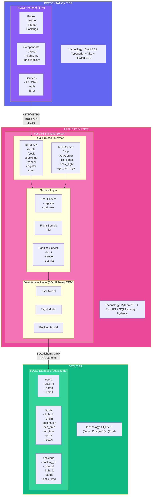

### Component Interaction Flow

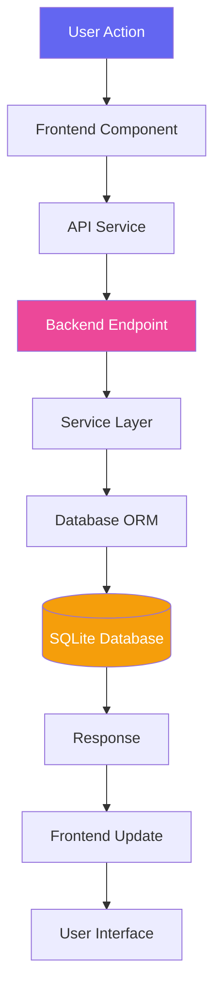

---

## Technology Stack

### Backend Stack
| Technology | Version | Purpose |
|------------|---------|---------|
| Python | 3.8+ | Core language |
| FastAPI | Latest | Web framework |
| SQLAlchemy | Latest | ORM |
| Pydantic | Latest | Data validation |
| FastMCP | Latest | MCP protocol support |
| Uvicorn | Latest | ASGI server |
| SQLite | 3 | Database |
| Pytest | Latest | Testing |

### Frontend Stack
| Technology | Version | Purpose |
|------------|---------|---------|
| React | 19.2.0 | UI library |
| TypeScript | 5.9.3 | Type safety |
| Vite | 7.2.4 | Build tool |
| React Router | 7.12.0 | Routing |
| Axios | 1.13.2 | HTTP client |
| Tailwind CSS | 3.4.19 | Styling |
| Framer Motion | 12.26.1 | Animations |
| Lucide React | 0.562.0 | Icons |
| React Hot Toast | 2.6.0 | Notifications |

---

## Backend Architecture

### Directory Structure

```
booking_system_backend/
├── server.py              # Main application entry point
├── models.py              # SQLAlchemy ORM models
├── schemas.py             # Pydantic schemas for validation
├── db.py                  # Database configuration
├── seed.py                # Database seeding script
├── requirements.txt       # Python dependencies
├── Dockerfile            # Container configuration
├── services/             # Business logic layer
│   ├── __init__.py
│   ├── user.py           # User management
│   ├── flight.py         # Flight operations
│   └── booking.py        # Booking operations
└── tests/                # Test suite
    ├── __init__.py
    ├── conftest.py       # Test configuration
    ├── test_rest.py      # REST API tests
    └── test_services.py  # Service layer tests
```

### Layered Architecture

#### 1. **Presentation Layer** (`server.py`)
- **REST API Endpoints**: HTTP endpoints for web clients
- **MCP Tools**: AI agent integration endpoints
- **CORS Middleware**: Cross-origin request handling
- **Request Validation**: Pydantic schema validation

#### 2. **Service Layer** (`services/`)
- **Business Logic**: Core application logic
- **Data Validation**: Input validation and sanitization
- **Error Handling**: Structured error responses
- **Transaction Management**: Database transaction handling

**Service Modules:**

```python
# user.py
- register_user(db, name, email) → UserOut | ErrorResponse
- get_user(db, name, email) → UserOut | ErrorResponse

# flight.py
- list_flights(db) → list[FlightOut]

# booking.py
- book_flight(db, user_id, name, flight_id) → BookingOut | ErrorResponse
- cancel_booking(db, booking_id) → BookingOut | ErrorResponse
- get_bookings(db, user_id) → list[BookingOut]
```

#### 3. **Data Access Layer** (`models.py`, `db.py`)
- **ORM Models**: SQLAlchemy model definitions
- **Database Session**: Session management
- **Schema Migrations**: Database initialization

### Dual Protocol Support

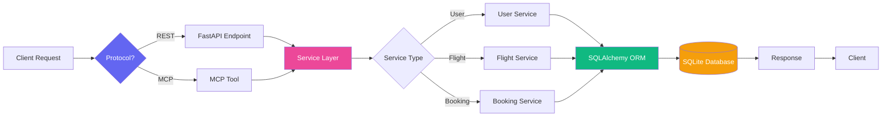

#### REST API
- Standard HTTP endpoints
- JSON request/response
- Swagger UI documentation at `/docs`
- Used by web frontend

#### MCP (Model Context Protocol)
- AI agent integration
- Tool-based interface
- Mounted at `/mcp`
- Used by AI assistants like Claude

**MCP Tools:**
1. `list_flights()` - Get all available flights
2. `book_flight(user_id, name, flight_id)` - Book a flight
3. `get_bookings(user_id)` - Get user bookings
4. `cancel_booking(booking_id)` - Cancel a booking
5. `register_user(name, email)` - Register new user
6. `get_user_id(name, email)` - Get user information

---

## Frontend Architecture

### Directory Structure

```
booking_system_frontend/
├── src/
│   ├── main.tsx              # Application entry point
│   ├── App.tsx               # Root component with routing
│   ├── index.css             # Global styles
│   ├── components/           # Reusable UI components
│   │   ├── common/           # Generic components
│   │   │   ├── Button.tsx
│   │   │   ├── Card.tsx
│   │   │   ├── Input.tsx
│   │   │   ├── Modal.tsx
│   │   │   ├── LoadingSpinner.tsx
│   │   │   ├── Starfield.tsx
│   │   │   └── index.ts
│   │   ├── layout/           # Layout components
│   │   │   ├── Header.tsx
│   │   │   ├── Footer.tsx
│   │   │   └── Layout.tsx
│   │   ├── flights/          # Flight-specific components
│   │   │   └── FlightCard.tsx
│   │   ├── bookings/         # Booking-specific components
│   │   │   ├── BookingCard.tsx
│   │   │   └── BookingModal.tsx
│   │   └── user/             # User-specific components
│   │       └── UserIdentification.tsx
│   ├── pages/                # Route pages
│   │   ├── Home.tsx
│   │   ├── Flights.tsx
│   │   └── MyBookings.tsx
│   ├── services/             # API integration
│   │   └── api.ts
│   ├── hooks/                # Custom React hooks
│   │   └── useUser.tsx
│   ├── types/                # TypeScript definitions
│   │   └── index.ts
│   └── utils/                # Utility functions
│       └── formatters.ts
├── public/                   # Static assets
├── index.html               # HTML template
├── package.json             # Dependencies
├── tsconfig.json            # TypeScript config
├── vite.config.ts           # Vite config
├── tailwind.config.js       # Tailwind config
└── postcss.config.js        # PostCSS config
```

### Component Architecture

#### Component Hierarchy

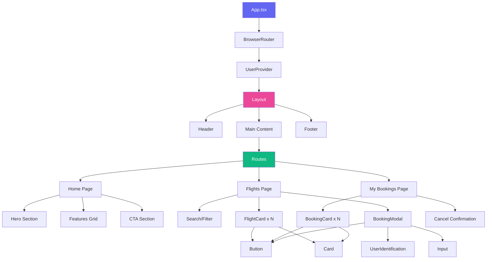

#### State Management

**Global State:**
- User Context (`useUser` hook)
  - Current user information
  - Authentication state
  - Logout functionality

**Local State:**
- Component-specific state (useState)
- Form state
- UI state (modals, loading, etc.)

**Server State:**
- Fetched via API calls
- No caching layer (direct API calls)
- Real-time data on each request

### Routing Structure

```
/ (Home)
├── /flights (Browse Flights)
└── /bookings (My Bookings)
```

### API Integration Layer

**API Service** (`services/api.ts`):
- Axios instance with base configuration
- Centralized error handling
- Type-safe request/response
- Environment-based API URL

**API Methods:**
```typescript
// Flights
getFlights(): Promise<Flight[]>

// Users
registerUser(data: UserRegistration): Promise<User | ErrorResponse>
getUserByCredentials(name, email): Promise<User | ErrorResponse>

// Bookings
bookFlight(data: BookingRequest): Promise<Booking | ErrorResponse>
getUserBookings(userId): Promise<Booking[]>
cancelBooking(bookingId): Promise<Booking | ErrorResponse>

// Utilities
healthCheck(): Promise<{status: string}>
isErrorResponse(response): boolean
```

---

## Database Schema

### Entity Relationship Diagram

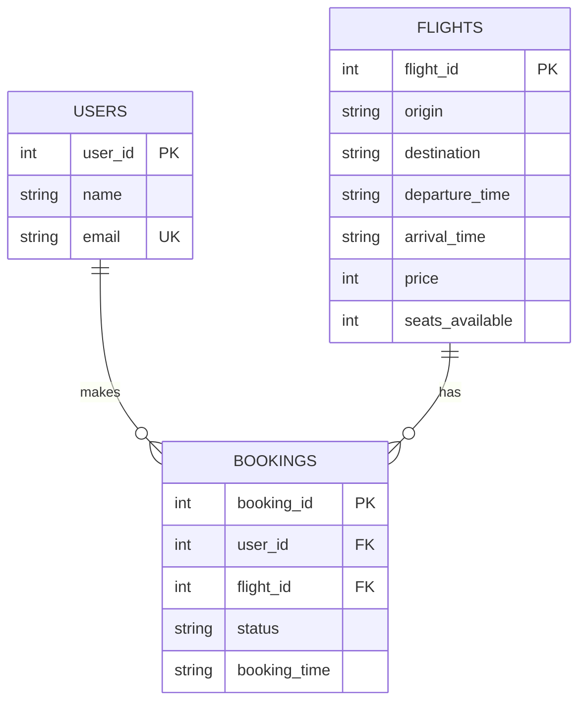

### Table Definitions

#### Users Table
```sql
CREATE TABLE users (
    user_id INTEGER PRIMARY KEY AUTOINCREMENT,
    name TEXT NOT NULL,
    email TEXT UNIQUE NOT NULL
);
```

**Fields:**
- `user_id`: Auto-incrementing primary key
- `name`: User's full name
- `email`: Unique email address (used for identification)

**Indexes:**
- Primary key on `user_id`
- Unique constraint on `email`

#### Flights Table
```sql
CREATE TABLE flights (
    flight_id INTEGER PRIMARY KEY AUTOINCREMENT,
    origin TEXT NOT NULL,
    destination TEXT NOT NULL,
    departure_time TEXT NOT NULL,
    arrival_time TEXT NOT NULL,
    price INTEGER NOT NULL,
    seats_available INTEGER NOT NULL
);
```

**Fields:**
- `flight_id`: Auto-incrementing primary key
- `origin`: Departure location (e.g., "Earth")
- `destination`: Arrival location (e.g., "Mars")
- `departure_time`: ISO 8601 datetime string
- `arrival_time`: ISO 8601 datetime string
- `price`: Ticket price in credits (integer)
- `seats_available`: Current available seats (decremented on booking)

**Indexes:**
- Primary key on `flight_id`

#### Bookings Table
```sql
CREATE TABLE bookings (
    booking_id INTEGER PRIMARY KEY AUTOINCREMENT,
    user_id INTEGER NOT NULL,
    flight_id INTEGER NOT NULL,
    status TEXT NOT NULL,
    booking_time TEXT NOT NULL,
    FOREIGN KEY (user_id) REFERENCES users(user_id),
    FOREIGN KEY (flight_id) REFERENCES flights(flight_id)
);
```

**Fields:**
- `booking_id`: Auto-incrementing primary key
- `user_id`: Foreign key to users table
- `flight_id`: Foreign key to flights table
- `status`: Booking status ("booked", "cancelled", "completed")
- `booking_time`: ISO 8601 datetime string

**Indexes:**
- Primary key on `booking_id`
- Foreign key on `user_id`
- Foreign key on `flight_id`

### Data Integrity Rules

1. **User Email Uniqueness**: Each email can only be registered once
2. **Seat Management**: 
   - Seats decremented atomically on booking
   - Seats incremented atomically on cancellation
   - Cannot book if seats_available < 1
3. **Booking Status**: 
   - New bookings start with "booked" status
   - Cancelled bookings cannot be cancelled again
4. **Referential Integrity**: 
   - Bookings must reference valid users and flights
   - Foreign key constraints enforced

---

## API Design

### REST API Endpoints

#### Health Check
```
GET /
Response: { "status": "OK" }
```

#### Flights

**List All Flights**
```
GET /flights
Response: Flight[]

Flight {
  flight_id: number
  origin: string
  destination: string
  departure_time: string (ISO 8601)
  arrival_time: string (ISO 8601)
  price: number
  seats_available: number
}
```

#### Users

**Register User**
```
POST /register
Request: {
  name: string
  email: string (valid email format)
}
Response: User | ErrorResponse

User {
  user_id: number
  name: string
  email: string
}
```

**Get User**
```
GET /user?name={name}&email={email}
Response: User | ErrorResponse
```

#### Bookings

**Book Flight**
```
POST /book
Request: {
  user_id: number
  name: string
  flight_id: number
}
Response: Booking | ErrorResponse

Booking {
  booking_id: number
  user_id: number
  flight_id: number
  status: string
  booking_time: string (ISO 8601)
}
```

**Get User Bookings**
```
GET /bookings/{user_id}
Response: Booking[]
```

**Cancel Booking**
```
POST /cancel/{booking_id}
Response: Booking | ErrorResponse
```

### Error Response Format

All endpoints return structured errors:

```typescript
ErrorResponse {
  success: false
  error: string          // Human-readable error message
  error_code: string     // Machine-readable error code
  details?: string       // Additional context
}
```

**Error Codes:**
- `FLIGHT_NOT_FOUND`: Flight doesn't exist
- `NO_SEATS_AVAILABLE`: Flight is fully booked
- `USER_NOT_FOUND`: User doesn't exist
- `NAME_MISMATCH`: User ID exists but name doesn't match
- `BOOKING_NOT_FOUND`: Booking doesn't exist
- `ALREADY_CANCELLED`: Booking already cancelled
- `EMAIL_EXISTS`: Email already registered
- `NETWORK_ERROR`: Network/connection error

### API Versioning

Current version: **v1.0.0**
- No version prefix in URLs (implicit v1)
- Future versions will use `/v2/` prefix
- Backward compatibility maintained

---

## Data Flow

### User Registration Flow

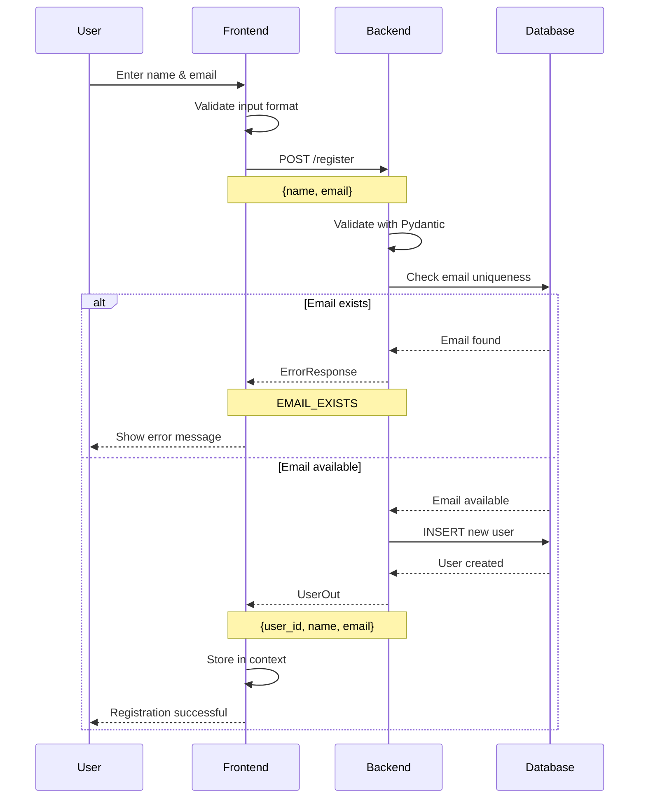

### Flight Booking Flow

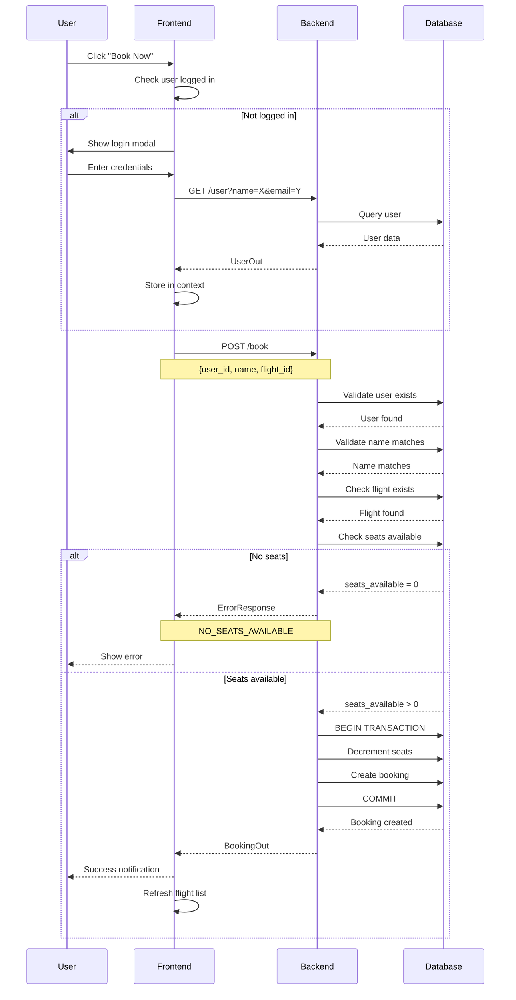

### Booking Cancellation Flow

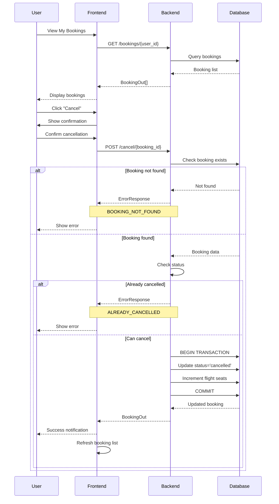

---

## Security Considerations

### Current Implementation

#### Authentication
- **Simple name/email identification** (no passwords)
- User context stored in browser localStorage
- Suitable for demo/prototype purposes

#### Data Validation
- **Backend**: Pydantic schemas validate all inputs
- **Frontend**: TypeScript type checking
- **Database**: SQLAlchemy ORM prevents SQL injection

#### CORS Policy
- Currently allows all origins (`allow_origins=["*"]`)
- Suitable for development
- Should be restricted in production

### Production Recommendations

#### 1. Authentication & Authorization
```python
# Implement JWT-based authentication
- Add password hashing (bcrypt)
- Implement JWT token generation
- Add token validation middleware
- Implement refresh tokens
- Add role-based access control (RBAC)
```

#### 2. API Security
```python
# Add rate limiting
from slowapi import Limiter
limiter = Limiter(key_func=get_remote_address)

# Add API key authentication for MCP
@app.middleware("http")
async def verify_api_key(request: Request, call_next):
    # Verify API key for /mcp endpoints
    pass
```

#### 3. Data Security
```python
# Encrypt sensitive data
- Hash passwords with bcrypt
- Encrypt email addresses at rest
- Use HTTPS only
- Implement data retention policies
```

#### 4. Input Validation
```python
# Enhanced validation
- Sanitize all user inputs
- Validate email format strictly
- Limit string lengths
- Validate date ranges
- Check for XSS attempts
```

#### 5. CORS Configuration
```python
# Restrict CORS in production
app.add_middleware(
    CORSMiddleware,
    allow_origins=["https://yourdomain.com"],
    allow_credentials=True,
    allow_methods=["GET", "POST"],
    allow_headers=["Content-Type", "Authorization"],
)
```

#### 6. Database Security
```python
# Production database setup
- Use PostgreSQL instead of SQLite
- Implement connection pooling
- Use read replicas for scaling
- Regular backups
- Encrypt database at rest
```

---

## Deployment Architecture

### Development Environment

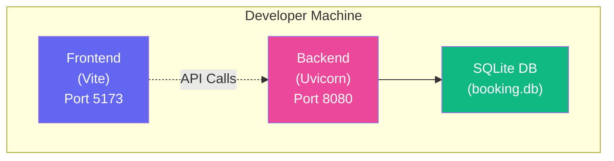

**Start Commands:**
```bash
# Backend
cd booking_system_backend
python -m venv .venv
source .venv/bin/activate
pip install -r requirements.txt
python server.py

# Frontend
cd booking_system_frontend
npm install
npm run dev
```

### Production Deployment Options

#### Option 1: Traditional Server Deployment

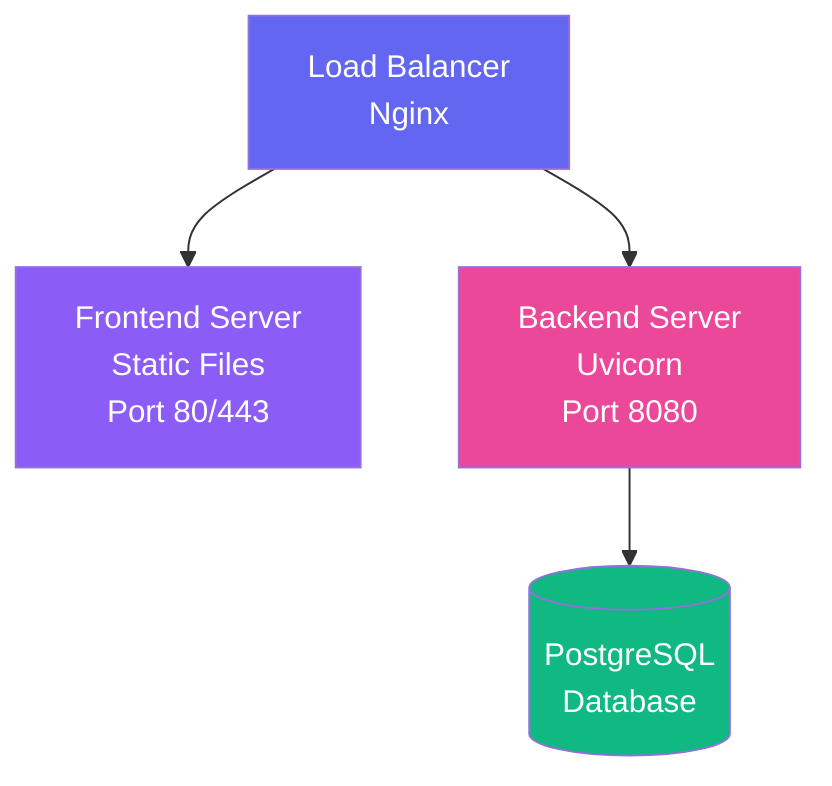

**Deployment Steps:**
```bash
# Frontend
npm run build
# Deploy dist/ folder to static hosting

# Backend
pip install -r requirements.txt
uvicorn server:app --host 0.0.0.0 --port 8080 --workers 4
```

#### Option 2: Docker Deployment

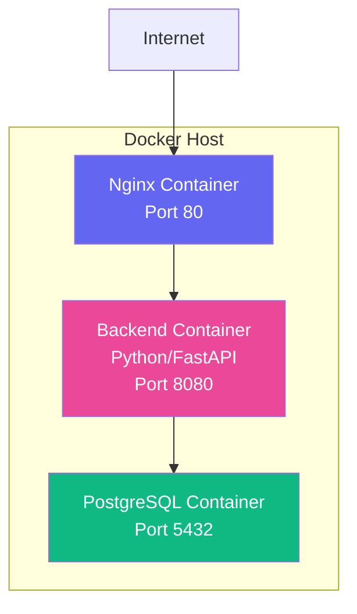

**Docker Compose:**
```yaml
version: '3.8'
services:
  frontend:
    build: ./booking_system_frontend
    ports:
      - "80:80"
    depends_on:
      - backend
  
  backend:
    build: ./booking_system_backend
    ports:
      - "8080:8080"
    environment:
      - DATABASE_URL=postgresql://user:pass@db:5432/galaxium
    depends_on:
      - db
  
  db:
    image: postgres:15
    environment:
      - POSTGRES_DB=galaxium
      - POSTGRES_USER=user
      - POSTGRES_PASSWORD=pass
    volumes:
      - postgres_data:/var/lib/postgresql/data

volumes:
  postgres_data:
```

#### Option 3: Cloud Platform Deployment (AWS)

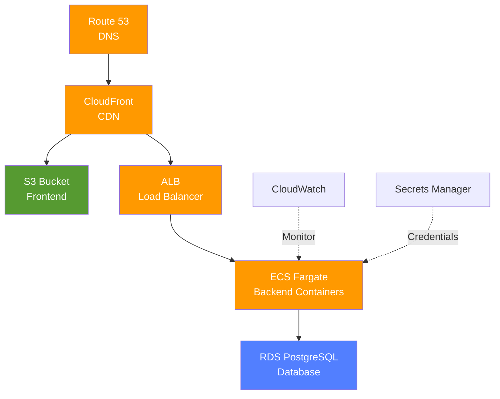

**Serverless Option (Vercel + Railway):**

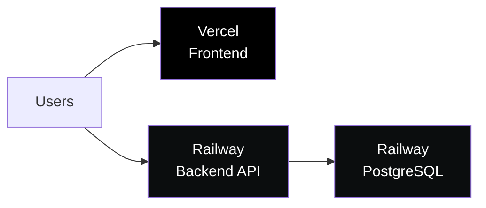

### Scaling Considerations

#### Horizontal Scaling
```python
# Backend: Multiple Uvicorn workers
uvicorn server:app --workers 4

# Or use Gunicorn with Uvicorn workers
gunicorn server:app -w 4 -k uvicorn.workers.UvicornWorker
```

#### Database Scaling

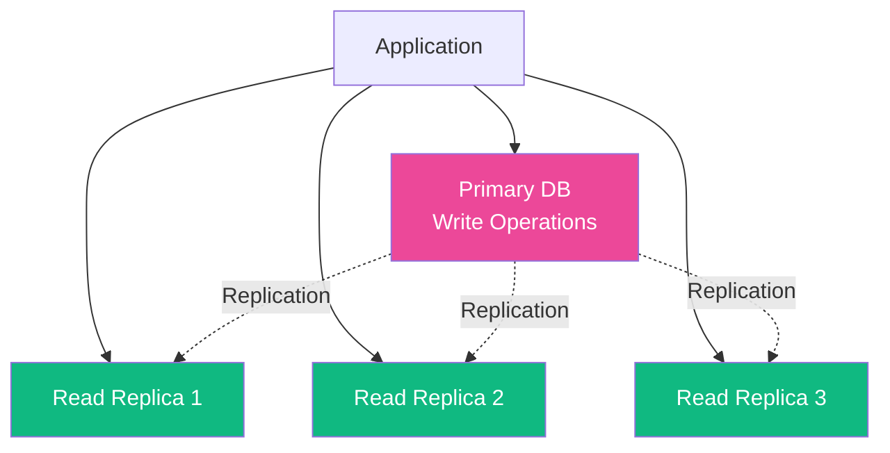

#### Caching Layer
```python
# Add Redis for caching
- Cache flight listings
- Cache user sessions
- Rate limiting storage
```

### Monitoring & Logging

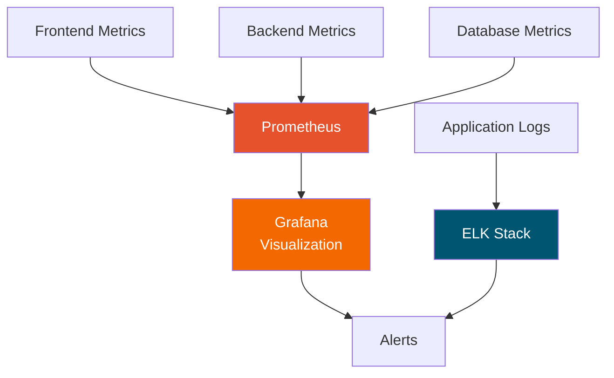

**Recommended Tools:**
- **Application Monitoring**: Sentry, DataDog
- **Logging**: ELK Stack (Elasticsearch, Logstash, Kibana)
- **Metrics**: Prometheus + Grafana
- **Uptime Monitoring**: UptimeRobot, Pingdom

**Key Metrics to Monitor:**
- API response times
- Error rates
- Database query performance
- Seat availability accuracy
- User registration/booking rates
- System resource usage (CPU, memory, disk)

---

## Performance Optimization

### Backend Optimizations

1. **Database Indexing**
```sql
CREATE INDEX idx_user_email ON users(email);
CREATE INDEX idx_booking_user ON bookings(user_id);
CREATE INDEX idx_booking_flight ON bookings(flight_id);
```

2. **Query Optimization**
```python
# Use eager loading for relationships
bookings = db.query(Booking).options(
    joinedload(Booking.user),
    joinedload(Booking.flight)
).filter(Booking.user_id == user_id).all()
```

3. **Connection Pooling**
```python
engine = create_engine(
    DATABASE_URL,
    pool_size=20,
    max_overflow=40,
    pool_pre_ping=True
)
```

### Frontend Optimizations

1. **Code Splitting**
```typescript
// Lazy load routes
const Flights = lazy(() => import('./pages/Flights'));
const MyBookings = lazy(() => import('./pages/MyBookings'));
```

2. **Image Optimization**
- Use WebP format
- Implement lazy loading
- Use CDN for static assets

3. **Bundle Optimization**
```javascript
// vite.config.ts
export default defineConfig({
  build: {
    rollupOptions: {
      output: {
        manualChunks: {
          vendor: ['react', 'react-dom', 'react-router-dom'],
          ui: ['framer-motion', 'lucide-react']
        }
      }
    }
  }
});
```

---

## Testing Strategy

### Backend Testing

**Unit Tests** (`test_services.py`):
- Service layer functions
- Business logic validation
- Error handling

**Integration Tests** (`test_rest.py`):
- API endpoint testing
- Database operations
- End-to-end flows

**Test Coverage Goals:**
- Service layer: 90%+
- API endpoints: 85%+
- Overall: 80%+

**Running Tests:**
```bash
cd booking_system_backend
pytest
pytest --cov=. --cov-report=html
```

### Frontend Testing

**Recommended Testing Stack:**
```json
{
  "vitest": "Testing framework",
  "@testing-library/react": "Component testing",
  "@testing-library/user-event": "User interaction testing",
  "msw": "API mocking"
}
```

**Test Types:**
- Component unit tests
- Integration tests
- E2E tests (Playwright/Cypress)

---

## Future Enhancements

### Phase 1: Core Features
- [ ] Payment integration
- [ ] Email notifications
- [ ] Booking history export
- [ ] Multi-language support

### Phase 2: Advanced Features
- [ ] Real-time seat availability (WebSockets)
- [ ] Flight recommendations (ML)
- [ ] Loyalty program
- [ ] Mobile app (React Native)

### Phase 3: Enterprise Features
- [ ] Admin dashboard
- [ ] Analytics and reporting
- [ ] API rate limiting
- [ ] Multi-tenant support

---

## Conclusion

Galaxium Travels demonstrates a modern, scalable architecture for a booking system with:
- Clean separation of concerns
- Type-safe implementation
- Dual protocol support (REST + MCP)
- Production-ready patterns
- Comprehensive error handling
- Extensible design

The architecture supports both human users (via web interface) and AI agents (via MCP), making it a versatile platform for interplanetary travel booking.

---

**Document Version:** 2.0.0  
**Last Updated:** 2026-03-21  
**Maintained By:** Galaxium Travels Development Team