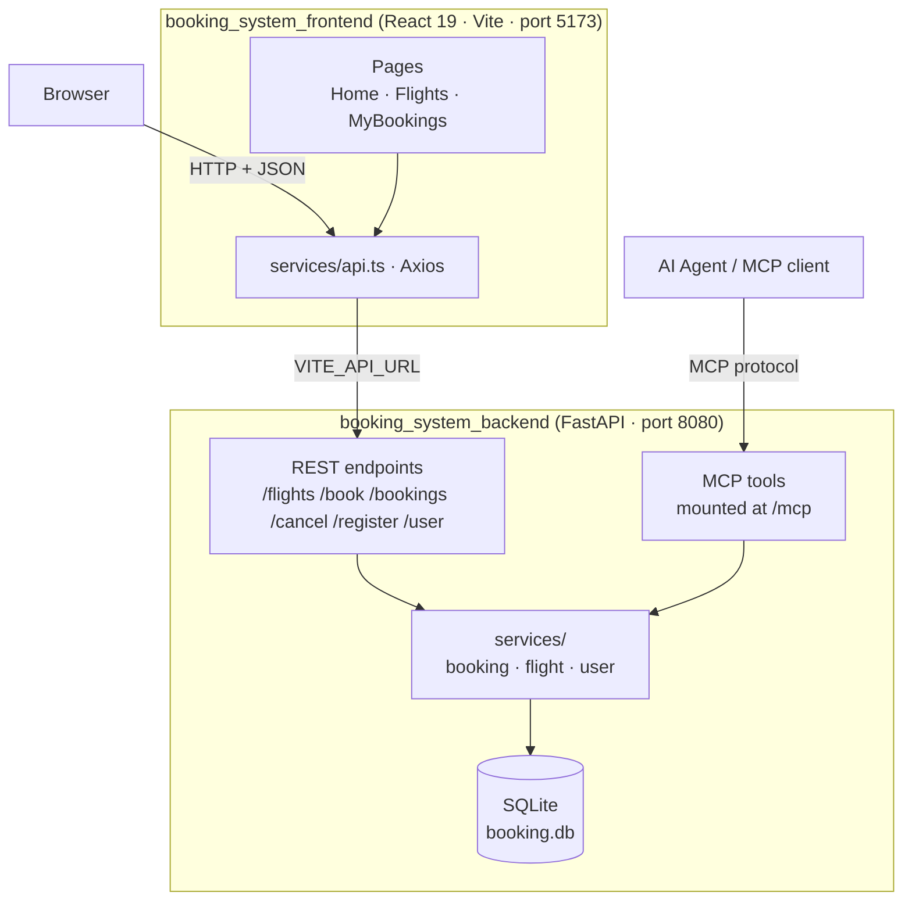
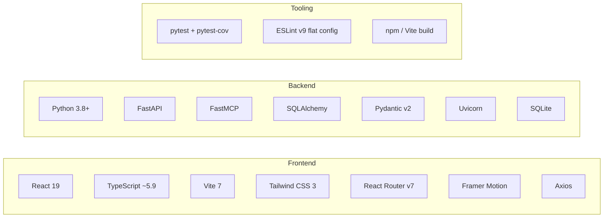
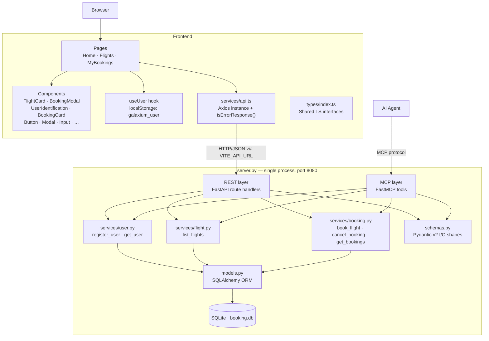
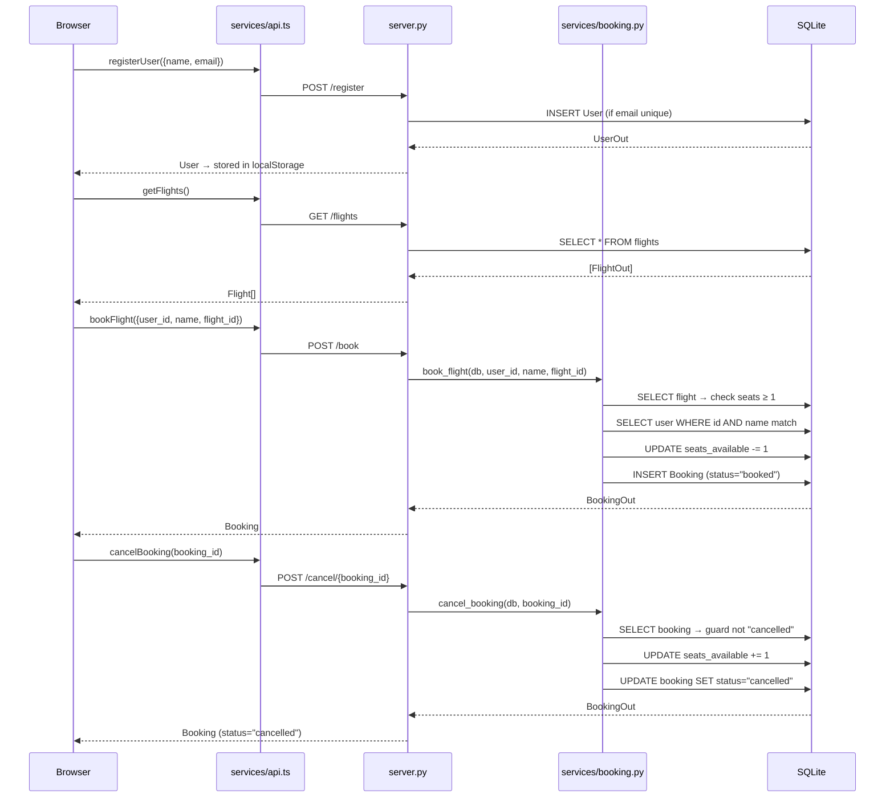

# Galaxium Travels — Developer Onboarding

This document captures everything a new contributor needs to understand before
modifying the codebase. It is derived from a full codebase audit and is the
authoritative reference for architecture, tech stack, component interactions,
test coverage, and deployment.

---

## Table of Contents

1. [Application Overview](#1-application-overview)
2. [Tech Stack](#2-tech-stack)
3. [Key Components and Their Interactions](#3-key-components-and-their-interactions)
4. [Unit Test Coverage](#4-unit-test-coverage)
5. [End-to-End Test Coverage](#5-end-to-end-test-coverage)
6. [Deployment Model](#6-deployment-model)

---

## 1. Application Overview

### Purpose

Galaxium Travels is a **demo full-stack booking system for interplanetary space
travel**. Users can browse flights between planets, register an account, book
seats, and cancel reservations. It also serves as a learning project for
exposing the same business logic over two protocols simultaneously — REST and
MCP (Model Context Protocol) — from a single server process.

### Project Structure

```
galaxium-travels/
├── booking_system_backend/   ← Python/FastAPI server
├── booking_system_frontend/  ← React/TypeScript SPA
├── start.sh                  ← One-command launcher (macOS/Linux)
├── AGENTS.md                 ← Instructions for AI coding agents
└── README.md
```

### High-Level Architecture



Both REST and MCP are served from the **same `server.py` process** on port
8080. The `FastMCP` instance is created before `app = FastAPI(...)` so that
lifespans compose correctly. They share one SQLite database and one set of
service functions. The database is wiped and re-seeded with demo data on every
server startup.

### Top-Level Directory Responsibilities

| Directory | Responsibility |
|---|---|
| `booking_system_backend/` | Entire server: REST routes, MCP tools, business logic, ORM models, Pydantic schemas, DB session management, seeding, and the test suite |
| `booking_system_frontend/` | Single-page React application: flight browsing, booking flow, user session (localStorage), and all UI components |
| `start.sh` | macOS/Linux convenience script — creates venv, installs deps, launches both servers in one terminal; not a production deployment tool |
| `AGENTS.md` | Project rules for AI coding agents (session management, error-handling patterns, testing conventions) |

---

## 2. Tech Stack

### Stack at a Glance



### Backend

| Dimension | Detail |
|---|---|
| **Language** | Python 3.8+ (3.9+ in practice — bare `list[T]` annotations used) |
| **Web framework** | FastAPI — ASGI, OpenAPI/Swagger at `/docs` |
| **Protocol layer** | FastMCP — MCP server mounted into FastAPI at `/mcp`; created before FastAPI app so lifespans compose |
| **ASGI server** | Uvicorn — launched via `uvicorn.run()` in `server.py` |
| **ORM** | SQLAlchemy — `declarative_base()`, three models: `User`, `Flight`, `Booking` |
| **Validation** | Pydantic v2 (`pydantic[email]`) — schemas use `from_attributes = True`; ORM objects converted with `model_validate()` |
| **Database** | SQLite — file `booking.db`; no migrations (schema via `Base.metadata.create_all()`); datetime values stored as ISO strings in `String` columns |
| **DB session** | `SessionLocal` factory; REST uses `Depends(get_db)`; MCP tools call `SessionLocal()` directly (no DI context) |
| **Seeding** | `seed.py` — wipes and re-inserts 10 users, 10 flights, 20 random bookings on every server start |
| **Test framework** | pytest + pytest-asyncio + pytest-cov + httpx |
| **Test DB** | In-memory SQLite — `conftest.py` patches both `server.SessionLocal` and `db.SessionLocal`; each test gets a fresh schema |
| **Container** | `Dockerfile` present (single-stage, Python 3.11-slim) |
| **Key dependencies** | `fastapi`, `fastmcp`, `uvicorn`, `sqlalchemy`, `pydantic[email]`, `python-dotenv`, `pytest`, `pytest-asyncio`, `pytest-cov`, `httpx` |

### Frontend

| Dimension | Detail |
|---|---|
| **Language** | TypeScript `~5.9.3` |
| **Runtime requirement** | Node.js 18+ / npm |
| **UI framework** | React 19 (`^19.2.0`) |
| **Build tool** | Vite 7 (`^7.2.4`) with `@vitejs/plugin-react` |
| **Routing** | React Router DOM v7 (`^7.12.0`) |
| **Styling** | Tailwind CSS v3 (`^3.4.19`) + PostCSS + Autoprefixer |
| **Animations** | Framer Motion (`^12.26.1`) |
| **HTTP client** | Axios (`^1.13.2`) — all calls through `src/services/api.ts` |
| **Notifications** | React Hot Toast (`^2.6.0`) |
| **Icons** | Lucide React (`^0.562.0`) |
| **Date formatting** | date-fns (`^4.1.0`) |
| **Conditional classes** | clsx (`^2.1.1`) |
| **Session persistence** | `localStorage` under key `galaxium_user` via `useUser` hook |
| **TypeScript config** | `strict`, `noUnusedLocals`, `noUnusedParameters`, `verbatimModuleSyntax` — type imports must use `import type` |
| **Linting** | ESLint v9 flat config — `typescript-eslint`, `eslint-plugin-react-hooks`, `eslint-plugin-react-refresh` |
| **Build check** | `npm run build` = `tsc -b && vite build` (type-checks before bundling) |
| **Tests** | None — `npm run build` is the only automated check |

### Design Tokens

All custom colours are defined in `booking_system_frontend/tailwind.config.js`.
Use these tokens in components — never raw hex values.

| Token | Hex | Role |
|---|---|---|
| `space-dark` | `#030712` | Page background |
| `space-blue` | `#0A1929` | Surface / card background |
| `cosmic-purple` | `#6366F1` | Primary accent |
| `nebula-pink` | `#EC4899` | Secondary accent |
| `alien-green` | `#10B981` | Success |
| `solar-orange` | `#F59E0B` | Warning |
| `star-white` | `#F9FAFB` | Body text |

Gradients: `space-gradient` (top→bottom dark), `cosmic-gradient` (135° purple→pink).

---

## 3. Key Components and Their Interactions

### Component Interaction Map



### Component Responsibilities

#### `services/api.ts` (frontend)

- Single Axios instance; `baseURL` from `VITE_API_URL ?? 'http://localhost:8080'`
- Response interceptor normalises all network/HTTP errors into `ErrorResponse` shape
- Exports one function per endpoint: `getFlights`, `registerUser`, `getUserByCredentials`, `bookFlight`, `getUserBookings`, `cancelBooking`, `healthCheck`
- Exports **`isErrorResponse(response)`** — checks `response.success === false`. This is the **only safe discriminator** for union responses; do not use `instanceof` or HTTP status.

#### `server.py` (backend)

Transport wiring only — no business logic. Two parallel sections:

| Section | Behaviour on error |
|---|---|
| REST | Returns `ErrorResponse` JSON with HTTP 200 — errors are in the body, not the status code |
| MCP | Checks `isinstance(result, ErrorResponse)` and raises `Exception` — MCP has no HTTP status codes |

MCP server is instantiated **before** `app = FastAPI(...)` — order is mandatory for lifespan composition.

#### `services/` (backend)

The only layer that touches the database. Shared contract across all three modules:

- Accept `Session` as first argument
- **Never raise** — return `SuccessSchema | ErrorResponse`
- Use `Model.model_validate(orm_obj)` for ORM → schema conversion

| Module | Functions | Notable behaviour |
|---|---|---|
| `services/user.py` | `register_user`, `get_user` | `get_user` matches **both** `name` AND `email` — partial match fails with `USER_NOT_FOUND` |
| `services/flight.py` | `list_flights` | Read-only; returns all flights with no filtering or pagination |
| `services/booking.py` | `book_flight`, `cancel_booking`, `get_bookings` | `book_flight`: validates flight → seats → user+name match, then atomically decrements `seats_available`; `cancel_booking`: guards double-cancel, then restores seat |

#### `models.py` (backend)

| Model | PK | Key constraints |
|---|---|---|
| `User` | `user_id` | `email` is `unique=True` |
| `Flight` | `flight_id` | `seats_available` mutated in-place on book/cancel; times stored as ISO `String` |
| `Booking` | `booking_id` | `status` is a plain `String` — no DB enum; values in practice: `"booked"`, `"cancelled"`, `"completed"` |

### Booking Lifecycle Data Flow



### Cross-Service Contracts — Must Know Before Modifying

| Contract | Rule |
|---|---|
| **Error discriminator** | `isErrorResponse()` checks `response.success === false`. The `ErrorResponse` shape in `schemas.py` must stay in sync with `types/index.ts`. Adding a field requires updating both. |
| **`BookingRequest` requires `name`** | `book_flight` validates `user_id` AND `name` match the same DB row. Passing a correct `user_id` with a wrong name returns `NAME_MISMATCH`, not success. |
| **No inventory hold service** | `seats_available` is decremented in-place on the `Flight` row — there is no separate inventory table, hold queue, or reservation timeout. |
| **`status` is an unguarded string** | The backend stores any string; the frontend narrows to `'booked' \| 'cancelled' \| 'completed'`. Adding a new status requires updating the service, seed data, and the frontend type. |
| **Datetimes are ISO strings everywhere** | `departure_time`, `arrival_time`, `booking_time` are `String` columns in SQLite and `string` in TypeScript. No automatic timezone handling. Parse with `date-fns` when comparing. |
| **MCP and REST share service functions** | Any change to a service affects both protocols. Update both the REST route docstring and the MCP tool docstring in `server.py`. |
| **No type code-gen** | TypeScript types in `types/index.ts` are manually maintained. They must be kept in sync with `schemas.py` by hand. |

---

## 4. Unit Test Coverage

### Infrastructure — `conftest.py`

| Fixture | Scope | Behaviour |
|---|---|---|
| `db_session` | `function` | Creates fresh in-memory SQLite schema before each test; drops it after |
| `client` | `function` | Wraps `db_session`; patches `db.SessionLocal` and `server.SessionLocal`; overrides `get_db` FastAPI dependency; suppresses `seed()` |
| `sample_user_data` | `function` | `{"name": "Test User", "email": "test@example.com"}` |
| `sample_flight_data` | `function` | Earth→Mars flight dict |
| `sample_booking_data` | `function` | Hard-codes `user_id=1, flight_id=1` — only safe after in-test DB setup |

> ⚠️ If you add a new module that imports `SessionLocal` at module level, you must add a corresponding `monkeypatch.setattr` in the `client` fixture or tests will hit the real database.

### `test_services.py` — Service Layer (13 tests)

Tests call service functions directly with `db_session`. No HTTP involved.

| Class | Tests |
|---|---|
| `TestFlightService` | Empty DB returns `[]`; one flight inserted returns it with correct fields |
| `TestUserService` | Successful registration; duplicate email → `EMAIL_EXISTS`; successful retrieval; not found → `USER_NOT_FOUND` |
| `TestBookingService` | Happy path (asserts seat decrement 5→4); `FLIGHT_NOT_FOUND`; `NO_SEATS_AVAILABLE`; `USER_NOT_FOUND`; `NAME_MISMATCH`; cancel success (asserts seat restore 4→5); `BOOKING_NOT_FOUND`; `ALREADY_CANCELLED`; `get_bookings` returns list; `get_bookings` returns `[]` |

### `test_rest.py` — HTTP Layer (11 tests)

Uses FastAPI `TestClient` in-process. Verifies route wiring, not service logic.

> All endpoints return **HTTP 200 even for errors** — the error is in the JSON body. Tests correctly assert `status_code == 200` then inspect `data["error_code"]`.

| Class | Happy path | Error path |
|---|---|---|
| `TestFlightsEndpoint` | Returns `[]` on empty DB; returns flight data | — |
| `TestRegisterEndpoint` | Returns `UserOut` with `user_id` | `EMAIL_EXISTS` via HTTP |
| `TestUserEndpoint` | Returns `UserOut` | `USER_NOT_FOUND` via HTTP |
| `TestBookEndpoint` | Returns `BookingOut` with `status="booked"` | `FLIGHT_NOT_FOUND` via HTTP |
| `TestBookingsEndpoint` | Returns list of 1 booking | Returns `[]` for user with no bookings |
| `TestCancelEndpoint` | Returns `status="cancelled"` | `BOOKING_NOT_FOUND` via HTTP |
| `TestHealthEndpoint` | `{"status": "OK"}` | — |

### Frontend Tests

**There are no frontend tests.** No test runner (Vitest, Jest) is configured in `package.json`. `npm run build` is the only automated check.

### Coverage Gaps

#### Backend service layer

| Gap | Detail |
|---|---|
| `cancel_booking` with orphaned flight | If the `Flight` row no longer exists, seat is silently not restored but cancellation still succeeds. The `if flight:` guard on line 75 of `services/booking.py` is untested. |
| `get_user` — email exists, wrong name | `USER_NOT_FOUND` is returned with no hint that the email is registered. No test distinguishes this from a completely unknown user. |
| `get_bookings` — multiple bookings / cross-user isolation | Only tested with exactly one booking. No test verifies it returns all bookings for a user and none for other users. |
| `book_flight` at `seats_available=1` | The boundary between success (1 seat) and failure (0 seats) is untested. |
| Invalid email format on `POST /register` | `pydantic[email]` should return 422. No test covers this validation error path at either layer. |

#### Backend HTTP layer

| Gap | Detail |
|---|---|
| `NAME_MISMATCH`, `NO_SEATS_AVAILABLE`, `ALREADY_CANCELLED` via HTTP | Covered in `test_services.py` only; not tested through the REST layer. |
| Malformed request bodies | Missing required fields on `POST /book` or `POST /register` return 422 — completely untested. |
| Seat count reflected in `GET /flights` after booking | No test chains `POST /book` → `GET /flights` to verify `seats_available` decremented in the HTTP response. |

#### Frontend (all gaps — no tests exist)

| Gap | Priority |
|---|---|
| `isErrorResponse()` discriminator | High — this function gates all error handling in the UI |
| `formatters.ts` pure functions (`calculateDuration`, `getRelativeTime`, `formatCurrency`) | High — pure functions, cheap to test, edge cases (sub-hour, invalid strings) unverified |
| `useUser` hook — `localStorage` persistence, `logout`, corrupt-JSON fallback | High — session behaviour is untested |
| `Flights.tsx` client-side search filter | Medium — case-insensitive match on origin/destination; empty-search passthrough |
| `MyBookings.tsx` active/past booking split | Medium — `status === 'booked'` vs everything else; `'completed'` placement unverified |

---

## 5. End-to-End Test Coverage

### Summary

**There are no end-to-end or integration tests in this repository.** Every search for `e2e`, `integration`, `*.spec.*`, `*.test.*`, Playwright, Cypress, Vitest, Jest, `docker-compose`, and `.env.test` returned no results.

### What the existing tests are not

`test_rest.py` is often mistaken for integration testing. It is not:

- FastAPI `TestClient` drives the ASGI app **in-process** — no real network socket
- The database is in-memory SQLite, not the real `booking.db`
- Seeding is suppressed
- No frontend is involved

The highest level of real integration that runs automatically is `npm run build`, which type-checks the frontend but makes no HTTP calls.

### Cross-service flow coverage

| Flow | Covered? |
|---|---|
| Browser → renders flight list from live backend | ❌ |
| Browser → sign-in flow → `POST /register` or `GET /user` | ❌ |
| `POST /book` → seat count updates in subsequent `GET /flights` | ❌ |
| Cancel confirmation modal → `POST /cancel` → status updates in UI | ❌ |
| `POST /register` with invalid email returns 422 | ❌ |
| Frontend `isErrorResponse()` against a real backend error response | ❌ |
| MCP `list_flights` → `book_flight` → `cancel_booking` sequence | ❌ |

### Infrastructure required to add E2E tests

None of the following currently exists:

| Component | Status |
|---|---|
| Browser automation tool (Playwright / Cypress) | ❌ Not installed, not configured |
| `docker-compose.yml` to run both services together | ❌ Does not exist |
| CI pipeline (`.github/workflows/`) | ❌ Does not exist |
| Test-mode backend (deterministic fixture state, resettable DB) | ❌ `seed.py` always wipes — not E2E-friendly |
| Frontend `Dockerfile` for containerised serving | ❌ Does not exist |

---

## 6. Deployment Model

### What exists

| Artifact | Location | Purpose |
|---|---|---|
| `booking_system_backend/Dockerfile` | Repo root | Containerise the backend |
| `start.sh` | Repo root | Local dev launcher (macOS/Linux only) |
| `booking_system_frontend/.env.example` | Frontend root | Documents `VITE_API_URL` env var |

Everything else referenced in typical deployment documentation — `docker-compose.yml`, `.github/workflows/`, Terraform, `fly.toml`, deployment scripts, a `docs/` folder — **does not exist**. The `.gitignore` contains `fly.toml` (gitignored, not present), indicating Fly.io deployment was planned but never completed.

### Backend Dockerfile

```dockerfile
FROM python:3.11-slim
WORKDIR /app
COPY . .
RUN pip install --no-cache-dir -r requirements.txt
EXPOSE 8080
CMD ["python", "server.py"]
```

Known gaps in this image:

| Issue | Impact |
|---|---|
| No `.dockerignore` | `tests/`, `.venv/`, `booking.db`, `pytest.ini` are all copied into the image |
| Runs as root | Security risk in production |
| No `HEALTHCHECK` instruction | Orchestrators (Kubernetes, ECS) cannot auto-detect readiness |
| `CMD ["python", "server.py"]` | Launches Uvicorn via `__main__` with defaults — no worker count, no timeout configuration |
| Database inside container | `booking.db` is created at `/app/booking.db` on startup; destroyed on container restart; no volume mount |

### Frontend deployment

No `Dockerfile` exists. Deployment is:

```bash
cd booking_system_frontend
npm run build          # produces dist/
# deploy dist/ to any static host
```

`VITE_API_URL` must be set at **build time** (it is inlined by Vite), not at runtime.

### `start.sh` — local dev only

- Checks for `python3` and `node` on `PATH`
- Creates `.venv` if absent; installs backend deps; starts `python server.py` in background
- Waits 2 seconds; installs frontend deps if `node_modules` absent; starts `npm run dev`
- `SIGINT`/`SIGTERM` trap kills both processes on `Ctrl+C`
- **macOS/Linux only** — no Windows equivalent

### Supported deployment targets today

| Target | Backend | Frontend | Notes |
|---|---|---|---|
| **Local dev** | `python server.py` or `start.sh` | `npm run dev` | Fully supported; only documented path |
| **Docker (manual)** | `docker build && docker run -p 8080:8080` | Not containerised | DB is ephemeral; no compose file |
| **Static host (Vercel, Netlify, S3)** | N/A | `npm run build` → deploy `dist/` | `VITE_API_URL` must point at a live backend at build time |
| **Fly.io** | Planned (gitignored `fly.toml`) | — | Not configured; `fly.toml` is absent |
| **Kubernetes / ECS / Cloud Run** | Image builds; missing health check, non-root user, volume | No image | Not configured; no manifests exist |

### What needs to be built for a real pipeline

| Component | Currently |
|---|---|
| `docker-compose.yml` | ❌ Missing — needed to run backend + nginx-served frontend together |
| Frontend `Dockerfile` | ❌ Missing — multi-stage: Node build → nginx serve |
| `.dockerignore` for backend | ❌ Missing — bloats image with test files and dev artifacts |
| Persistent volume / real DB | ❌ SQLite inside container is ephemeral — needs volume mount or Postgres migration |
| CI pipeline | ❌ Missing — at minimum: `pytest` on push, `npm run build` on push, Docker image build |
| `fly.toml` or IaC | ❌ Missing — needed for any cloud target |
| Backend env vars documented | ❌ `python-dotenv` is installed but no `.env.example` exists for the backend; DB URL is hardcoded in `db.py` |
| Production Uvicorn config | ❌ Worker count, timeouts, log format all use Uvicorn defaults |

---

*Document generated from full codebase audit — June 2025.*
