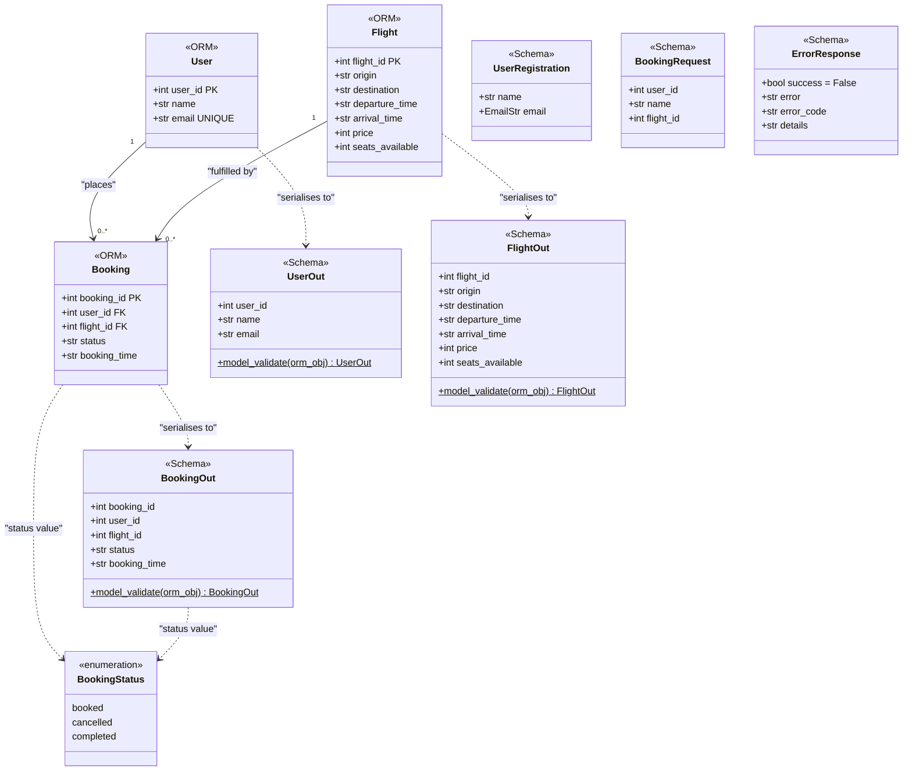

# Class Diagram

Covers the three SQLAlchemy ORM models (`User`, `Flight`, `Booking`) defined in
`booking_system_backend/models.py`, the five Pydantic schemas (`UserOut`,
`UserRegistration`, `FlightOut`, `BookingOut`, `BookingRequest`, `ErrorResponse`)
defined in `booking_system_backend/schemas.py`, and a `BookingStatus`
pseudo-enumeration derived from the string literals used across the codebase.
Relationships show FK associations between ORM models and the serialisation
dependency from each ORM model to its corresponding `*Out` schema.

> **Note:** `BookingStatus` does not exist as a Python `enum` class. It is
> represented here to document the three known string values used for
> `Booking.status`; there is no DB-level constraint enforcing them.

