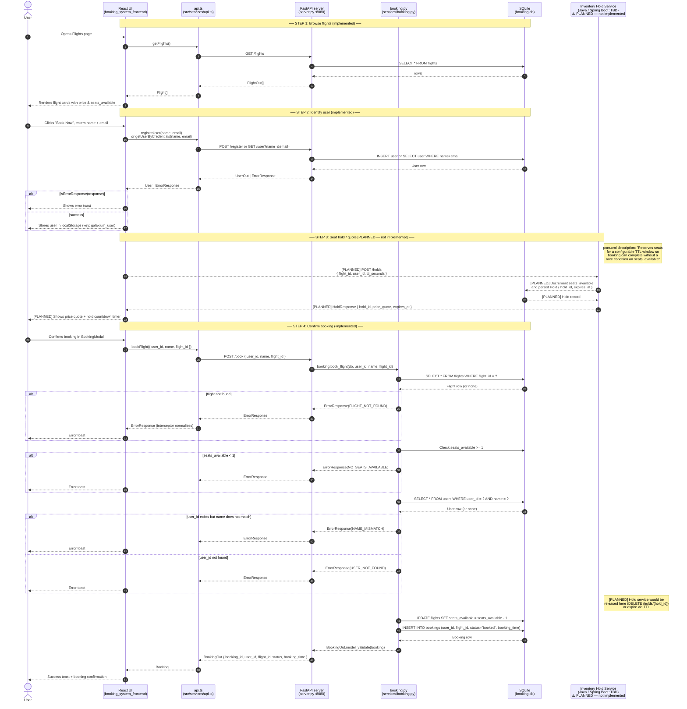

# Booking Flow Sequence Diagram

Shows the complete end-to-end flow for a user booking a flight, spanning four
participants: the React UI (`booking_system_frontend`), the `api.ts` service
layer, the FastAPI server (`server.py`), the `booking.py` service, and the
SQLite database. A fifth participant — the Inventory Hold Service
(`booking_system_inventory_hold_service`) — is included as a **planned but not
yet implemented** step, derived from the `pom.xml` description. Those steps are
annotated with `[PLANNED]` throughout.

The diagram covers three implemented phases (browse flights, identify user,
confirm booking) and one planned phase (seat hold / price quote via the Java
Spring Boot microservice).

