# Use Case Diagram

Identifies all actors and the use cases each can perform across the full
Galaxium Travels application. Actors are derived from the frontend pages
(`Home`, `Flights`, `MyBookings`), the backend REST endpoints (`server.py`),
and the MCP tools. Use cases are grouped into subgraphs per actor; arrows show
actor-to-use-case ownership, frontend-to-REST wiring, and MCP-tool-to-service
routing.

**Actors:**

| Actor | Description |
|---|---|
| Guest User | Unauthenticated browser visitor; no `localStorage` session present |
| Authenticated User | Browser visitor with a session stored in `localStorage` under key `galaxium_user` |
| AI Agent | Any MCP client connecting to `/mcp`; uses the six registered MCP tools |
| FastAPI Server | Internal runtime that owns all REST handler and service dispatch logic |
| SQLite DB | Persistence layer; `booking.db` file, wiped and re-seeded on every startup |

> **Note:** Curly braces in path parameters (`{user_id}`, `{booking_id}`) are
> HTML-entity-escaped (`&#123;` / `&#125;`) to prevent Mermaid from
> interpreting them as template syntax.

```mermaid
flowchart LR

    %% ── Actors ────────────────────────────────────────────────────────────────
    GuestUser["👤 Guest User\n(unauthenticated browser)"]
    AuthUser["👤 Authenticated User\n(session in localStorage)"]
    AIAgent["🤖 AI Agent\n(MCP client)"]
    FastAPIServer["⚙️ FastAPI Server\n(server.py :8080)"]
    SQLiteDB[("🗄️ SQLite DB\nbooking.db")]

    %% ── Guest use cases ───────────────────────────────────────────────────────
    subgraph GuestUseCases["Guest User — use cases"]
        direction TB
        UC_ViewHome["View home page"]
        UC_BrowseFlights["Browse available flights"]
        UC_SearchFilter["Search / filter flights\nby origin or destination"]
        UC_SignIn["Sign in with name + email"]
        UC_Register["Register new account"]
    end

    %% ── Authenticated user use cases ──────────────────────────────────────────
    subgraph AuthUseCases["Authenticated User — use cases"]
        direction TB
        UC_BookFlight["Book a flight\n(POST /book)"]
        UC_ViewBookings["View my bookings\n(GET /bookings/&#123;user_id&#125;)"]
        UC_CancelBooking["Cancel a booking\n(POST /cancel/&#123;booking_id&#125;)"]
        UC_Logout["Log out\n(clears localStorage)"]
    end

    %% ── AI Agent / MCP use cases ──────────────────────────────────────────────
    subgraph MCPUseCases["AI Agent via MCP — use cases\n(tools mounted at /mcp)"]
        direction TB
        UC_MCP_ListFlights["list_flights()"]
        UC_MCP_BookFlight["book_flight(user_id, name, flight_id)"]
        UC_MCP_GetBookings["get_bookings(user_id)"]
        UC_MCP_CancelBooking["cancel_booking(booking_id)"]
        UC_MCP_RegisterUser["register_user(name, email)"]
        UC_MCP_GetUser["get_user_id(name, email)"]
    end

    %% ── REST endpoints exposed by FastAPI ─────────────────────────────────────
    subgraph RESTEndpoints["FastAPI REST endpoints\n(server.py)"]
        direction TB
        EP_Health["GET /"]
        EP_Flights["GET /flights"]
        EP_Book["POST /book"]
        EP_Bookings["GET /bookings/&#123;user_id&#125;"]
        EP_Cancel["POST /cancel/&#123;booking_id&#125;"]
        EP_Register["POST /register"]
        EP_User["GET /user"]
    end

    %% ── Guest actor → use cases ───────────────────────────────────────────────
    GuestUser --> UC_ViewHome
    GuestUser --> UC_BrowseFlights
    GuestUser --> UC_SearchFilter
    GuestUser --> UC_SignIn
    GuestUser --> UC_Register

    %% ── Authenticated actor → use cases ───────────────────────────────────────
    AuthUser --> UC_BookFlight
    AuthUser --> UC_ViewBookings
    AuthUser --> UC_CancelBooking
    AuthUser --> UC_Logout
    AuthUser --> UC_BrowseFlights
    AuthUser --> UC_SearchFilter

    %% ── Sign-in / register gate: guest becomes authenticated ──────────────────
    UC_SignIn -->|"success → session stored"| AuthUser
    UC_Register -->|"success → session stored"| AuthUser

    %% ── Frontend API calls → REST endpoints ───────────────────────────────────
    UC_BrowseFlights --> EP_Flights
    UC_SignIn --> EP_User
    UC_Register --> EP_Register
    UC_BookFlight --> EP_Book
    UC_ViewBookings --> EP_Bookings
    UC_CancelBooking --> EP_Cancel

    %% ── AI Agent → MCP tools ──────────────────────────────────────────────────
    AIAgent --> UC_MCP_ListFlights
    AIAgent --> UC_MCP_BookFlight
    AIAgent --> UC_MCP_GetBookings
    AIAgent --> UC_MCP_CancelBooking
    AIAgent --> UC_MCP_RegisterUser
    AIAgent --> UC_MCP_GetUser

    %% ── MCP tools → REST endpoints (same service layer, not via HTTP) ──────────
    UC_MCP_ListFlights -->|"SessionLocal() direct"| EP_Flights
    UC_MCP_BookFlight -->|"SessionLocal() direct"| EP_Book
    UC_MCP_GetBookings -->|"SessionLocal() direct"| EP_Bookings
    UC_MCP_CancelBooking -->|"SessionLocal() direct"| EP_Cancel
    UC_MCP_RegisterUser -->|"SessionLocal() direct"| EP_Register
    UC_MCP_GetUser -->|"SessionLocal() direct"| EP_User

    %% ── FastAPI → SQLite ──────────────────────────────────────────────────────
    FastAPIServer --> SQLiteDB
    RESTEndpoints --> FastAPIServer
```

