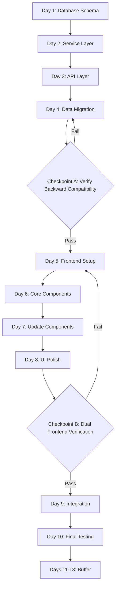

# Implementation Roadmap for Seat Classes (Updated with Backward Compatibility Checkpoints)

## Project Timeline: 9-13 Days

This roadmap provides a detailed, step-by-step guide for implementing seat classes in Galaxium Travels, with clear dependencies and milestones.

## ⚠️ CRITICAL: Backward Compatibility Verification Strategy

**Implementation Order:**
1. **Complete ALL backend changes first** (Days 1-4)
2. **CHECKPOINT A: Verify backward compatibility** with original frontend
3. **Only then proceed** with new frontend development (Days 5-8)
4. **CHECKPOINT B: Final verification** with both frontends running simultaneously

This ensures the original frontend continues working throughout the entire process.

---

## Phase 1: Backend Foundation (Days 1-4)

### Day 1: Database Schema Updates
**Goal:** Update database models and create migration strategy

#### Tasks
1. **Update models.py** (2 hours)
   - Add new columns to Flight model
   - Add new columns to Booking model
   - Add helper methods for seat class operations
   - **CRITICAL:** Maintain old fields for backward compatibility
   - Add validation logic

2. **Create migration script** (2 hours)
   - Write database migration functions
   - Add rollback capability
   - Test on development database

3. **Update db.py** (1 hour)
   - Ensure compatibility with new schema
   - Add any necessary initialization logic

4. **Testing** (3 hours)
   - Unit tests for model methods
   - Migration testing
   - Rollback testing
   - Data integrity validation

**Dependencies:** None
**Deliverables:** 
- Updated [`models.py`](galaxium-travels/booking_system_backend/models.py)
- Migration script
- Test suite for models

**Checkpoint:** Database schema successfully updated and tested

---

### Day 2: Backend Service Layer
**Goal:** Update service layer to handle seat classes with backward compatibility

#### Tasks
1. **Update services/flight.py** (3 hours)
   - Modify `get_all_flights()` to return both old and new format
   - Add seat class price calculation
   - Add seat availability checks per class
   - **CRITICAL:** Include deprecated fields in response

2. **Update services/booking.py** (4 hours)
   - Modify `book_flight()` with optional seat_class parameter (defaults to 'economy')
   - Update seat availability logic for specific classes
   - **CRITICAL:** Update both old and new seat counters
   - Modify `cancel_booking()` to restore correct class seats
   - Update `get_bookings()` to include seat class info

3. **Testing** (1 hour)
   - Unit tests for all service functions
   - Test each seat class booking
   - Test cancellation logic
   - **Test default behavior when seat_class not provided**

**Dependencies:** Day 1 completed
**Deliverables:**
- Updated [`services/flight.py`](galaxium-travels/booking_system_backend/services/flight.py)
- Updated [`services/booking.py`](galaxium-travels/booking_system_backend/services/booking.py)
- Service layer tests

**Checkpoint:** Service layer handles seat classes correctly with backward compatibility

---

### Day 3: API Layer & Schemas
**Goal:** Update API endpoints with backward compatible schemas

#### Tasks
1. **Update schemas.py** (2 hours)
   - Add new Pydantic models for seat classes
   - Update existing schemas to include both old and new fields
   - Make seat_class parameter optional with default value
   - Add backward compatibility schemas

2. **Update server.py** (3 hours)
   - Modify existing endpoints to return both formats
   - Add new `/seat-classes` endpoint
   - **CRITICAL:** Ensure all responses include deprecated fields
   - Update CORS to allow both frontend ports

3. **Error Handling** (1 hour)
   - Add new error codes
   - Update error responses
   - Test error scenarios

4. **Testing** (2 hours)
   - Integration tests for all endpoints
   - **Test backward compatibility scenarios**
   - API documentation updates

**Dependencies:** Days 1-2 completed
**Deliverables:**
- Updated [`schemas.py`](galaxium-travels/booking_system_backend/schemas.py)
- Updated [`server.py`](galaxium-travels/booking_system_backend/server.py)
- API integration tests

**Checkpoint:** Backend API fully supports seat classes with backward compatibility

---

### Day 4: Data Migration & Seeding
**Goal:** Update seed data and migrate existing data

#### Tasks
1. **Update seed.py** (3 hours)
   - Implement seat distribution logic
   - Add route type classification
   - Create flights with seat classes
   - **CRITICAL:** Populate both old and new fields
   - Generate bookings with seat classes

2. **Run Migration** (1 hour)
   - Backup existing data
   - Run migration script
   - Verify data integrity
   - **Verify old fields are populated correctly**

3. **Testing** (2 hours)
   - Verify seed data correctness
   - Test with backend only
   - Validate pricing calculations
   - **Verify old field synchronization**

4. **Documentation** (2 hours)
   - Update API documentation
   - Document migration process
   - Create troubleshooting guide

**Dependencies:** Phase 1 (Days 1-3) completed
**Deliverables:**
- Updated [`seed.py`](galaxium-travels/booking_system_backend/seed.py)
- Migrated database
- Updated documentation

**Checkpoint:** Database populated with seat class data, old fields maintained

---

## 🔍 CHECKPOINT A: Backward Compatibility Verification (End of Day 4)

### Critical Verification Steps

#### 1. Start Backend Only
```bash
cd booking_system_backend
source .venv/bin/activate
python seed.py
uvicorn server:app --reload
```

#### 2. Test Backend Endpoints Manually
```bash
# Test flights endpoint returns old format fields
curl http://localhost:8000/flights | jq '.[0] | {price, seats_available}'

# Should return: {"price": 1000000, "seats_available": 10}
```

#### 3. Start Original Frontend
```bash
cd booking_system_frontend
npm run dev
```

#### 4. Manual Testing Checklist
- [ ] Original frontend loads successfully
- [ ] Flights are displayed correctly
- [ ] Prices show correctly (using old `price` field)
- [ ] Seat availability shows correctly (using old `seats_available` field)
- [ ] User can book a flight (without seat_class parameter)
- [ ] Booking defaults to Economy class
- [ ] Booking confirmation shows correctly
- [ ] User can view their bookings
- [ ] User can cancel a booking
- [ ] Seat availability updates correctly after booking
- [ ] No console errors in browser
- [ ] No API errors in backend logs

#### 5. Automated Testing
```bash
cd booking_system_backend
pytest tests/ -v
```

#### 6. Verification Criteria
**ALL of the following must pass before proceeding:**
- ✅ All unit tests passing
- ✅ All integration tests passing
- ✅ Original frontend works without any changes
- ✅ No breaking changes to API responses
- ✅ Old fields (`price`, `seats_available`) present in all responses
- ✅ Bookings default to Economy when seat_class not provided
- ✅ Database maintains data integrity

### If Checkpoint A Fails
**DO NOT PROCEED to frontend development.**
1. Review backward compatibility strategy
2. Fix issues in backend
3. Re-test until all criteria pass
4. Document any issues found

### If Checkpoint A Passes
✅ **Backend is backward compatible**
✅ **Safe to proceed with new frontend development**

---

## Phase 2: Frontend Development (Days 5-8)

**PREREQUISITE:** Checkpoint A must pass before starting this phase.

### Day 5: Frontend Setup & Configuration
**Goal:** Set up new frontend project structure

#### Tasks
1. **Clone Frontend Project** (1 hour)
   - Copy booking_system_frontend to booking_system_frontend_classes
   - Update project name in package.json
   - Update configuration files

2. **Update Configuration** (2 hours)
   - Modify vite.config.ts for port 5174
   - Update environment variables
   - Configure build scripts

3. **Update TypeScript Types** (2 hours)
   - Add seat class types
   - Update Flight interface
   - Update Booking interface
   - Add new type definitions

4. **Update API Service** (3 hours)
   - Add seat class endpoints
   - Update existing API calls
   - Add error handling

**Dependencies:** Checkpoint A passed
**Deliverables:**
- New frontend project at port 5174
- Updated type definitions
- Updated API service layer

**Checkpoint:** Frontend project configured and ready for development

---

### Day 6: Core Components Development
**Goal:** Create new seat class components

#### Tasks
1. **Create SeatClassCard Component** (3 hours)
   - Design component structure
   - Implement styling
   - Add interactions
   - Test component

2. **Create SeatClassSelector Component** (2 hours)
   - Implement selection logic
   - Add validation
   - Test component

3. **Create SeatClassBadge Component** (1 hour)
   - Design badge styles
   - Implement for each class
   - Test component

4. **Testing** (2 hours)
   - Unit tests for all components
   - Visual regression testing
   - Accessibility testing

**Dependencies:** Day 5 completed
**Deliverables:**
- SeatClassCard component
- SeatClassSelector component
- SeatClassBadge component
- Component tests

**Checkpoint:** Core seat class components completed

---

### Day 7: Update Existing Components
**Goal:** Integrate seat classes into existing components

#### Tasks
1. **Update FlightCard Component** (2 hours)
   - Add seat class display
   - Update pricing display
   - Test changes

2. **Update BookingModal Component** (3 hours)
   - Integrate SeatClassSelector
   - Update booking flow
   - Add price calculation
   - Test booking process

3. **Update BookingCard Component** (2 hours)
   - Add seat class badge
   - Display price paid
   - Test display

4. **Testing** (1 hour)
   - Integration testing
   - User flow testing
   - Cross-browser testing

**Dependencies:** Day 6 completed
**Deliverables:**
- Updated FlightCard
- Updated BookingModal
- Updated BookingCard
- Integration tests

**Checkpoint:** All components support seat classes

---

### Day 8: UI Polish & Optimization
**Goal:** Refine UI/UX and optimize performance

#### Tasks
1. **UI/UX Refinement** (3 hours)
   - Polish animations
   - Refine color schemes
   - Improve responsive design
   - Add loading states

2. **Performance Optimization** (2 hours)
   - Optimize re-renders
   - Add memoization
   - Lazy load components
   - Test performance

3. **Accessibility** (2 hours)
   - Add ARIA labels
   - Test keyboard navigation
   - Verify screen reader support
   - Check color contrast

4. **Testing** (1 hour)
   - E2E testing
   - Performance testing
   - Accessibility audit

**Dependencies:** Day 7 completed
**Deliverables:**
- Polished UI
- Optimized performance
- Accessible components
- E2E tests

**Checkpoint:** New frontend fully functional and polished

---

## 🔍 CHECKPOINT B: Dual Frontend Verification (End of Day 8)

### Critical Verification Steps

#### 1. Start Backend
```bash
cd booking_system_backend
source .venv/bin/activate
uvicorn server:app --reload
```

#### 2. Start Both Frontends Simultaneously
```bash
# Terminal 1: Original Frontend
cd booking_system_frontend
npm run dev  # Port 5173

# Terminal 2: New Frontend
cd booking_system_frontend_classes
npm run dev  # Port 5174
```

#### 3. Dual Frontend Testing Checklist

**Original Frontend (Port 5173):**
- [ ] Loads successfully
- [ ] All existing functionality works
- [ ] Can book flights (defaults to Economy)
- [ ] Can view bookings
- [ ] Can cancel bookings
- [ ] No errors or warnings

**New Frontend (Port 5174):**
- [ ] Loads successfully
- [ ] Displays all three seat classes
- [ ] Shows correct pricing for each class
- [ ] Can select different seat classes
- [ ] Can book flights with selected class
- [ ] Booking confirmation shows correct class and price
- [ ] Can view bookings with seat class info
- [ ] Can cancel bookings
- [ ] No errors or warnings

**Cross-Frontend Testing:**
- [ ] Booking from old frontend visible in new frontend
- [ ] Booking from new frontend visible in old frontend
- [ ] Seat availability updates correctly across both
- [ ] No data inconsistencies
- [ ] Both can operate simultaneously without conflicts

#### 4. Concurrent Booking Test
1. Open both frontends side by side
2. Book Economy seat from old frontend
3. Verify availability decreases in both frontends
4. Book Business seat from new frontend
5. Verify availability decreases in both frontends
6. Cancel booking from old frontend
7. Verify availability increases in both frontends

#### 5. Verification Criteria
**ALL of the following must pass:**
- ✅ Both frontends operational simultaneously
- ✅ Original frontend unchanged and working
- ✅ New frontend has full seat class functionality
- ✅ Data consistency across both frontends
- ✅ No conflicts or race conditions
- ✅ Backend handles both request formats correctly

### If Checkpoint B Fails
1. Identify which frontend has issues
2. Review integration points
3. Check API compatibility
4. Fix issues and re-test
5. Document any issues found

### If Checkpoint B Passes
✅ **Both frontends working correctly**
✅ **Safe to proceed with final integration**

---

## Phase 3: Integration & Deployment (Days 9-10)

**PREREQUISITE:** Checkpoint B must pass before starting this phase.

### Day 9: System Integration
**Goal:** Integrate all components and test end-to-end

#### Tasks
1. **Update Startup Scripts** (2 hours)
   - Modify start.sh for both frontends
   - Modify start.bat for both frontends
   - Test startup process
   - Update documentation

2. **Integration Testing** (3 hours)
   - Test complete booking flow
   - Test both frontends simultaneously
   - Test edge cases
   - Test error scenarios

3. **Documentation Updates** (3 hours)
   - Update README.md
   - Update DEVELOPER_GUIDE.md
   - Update API_REFERENCE.md
   - Create user guide

**Dependencies:** Checkpoint B passed
**Deliverables:**
- Updated startup scripts
- Comprehensive documentation
- Integration test suite

**Checkpoint:** System fully integrated

---

### Day 10: Final Testing & Deployment Prep
**Goal:** Final validation and deployment preparation

#### Tasks
1. **Comprehensive Testing** (3 hours)
   - Full regression testing
   - Load testing
   - Security testing
   - User acceptance testing

2. **Bug Fixes** (3 hours)
   - Address any issues found
   - Verify fixes
   - Re-test affected areas

3. **Deployment Preparation** (2 hours)
   - Create deployment checklist
   - Prepare rollback plan
   - Document deployment steps
   - Final review

**Dependencies:** Day 9 completed
**Deliverables:**
- Test reports
- Bug fixes
- Deployment documentation
- Rollback plan

**Checkpoint:** System ready for deployment

---

## Phase 4: Buffer & Documentation (Days 11-13)

### Days 11-13: Buffer Time & Polish
**Goal:** Address any remaining issues and finalize documentation

#### Tasks
1. **Address Remaining Issues** (Variable)
   - Fix any outstanding bugs
   - Implement feedback
   - Optimize performance
   - Refine UI/UX

2. **Final Documentation** (Variable)
   - Complete all documentation
   - Create video tutorials (optional)
   - Prepare training materials
   - Update changelog

3. **Knowledge Transfer** (Variable)
   - Team training sessions
   - Code walkthrough
   - Q&A sessions
   - Handover documentation

**Dependencies:** Phase 3 completed
**Deliverables:**
- Production-ready system
- Complete documentation
- Training materials

**Checkpoint:** Project complete and ready for production

---

## Critical Path with Checkpoints



## Success Metrics

### Technical Metrics
- [ ] All unit tests passing (>95% coverage)
- [ ] **Checkpoint A passed: Original frontend works unchanged**
- [ ] **Checkpoint B passed: Both frontends work simultaneously**
- [ ] API response time <200ms
- [ ] Frontend load time <2s
- [ ] Zero data corruption incidents

### Business Metrics
- [ ] Both frontends operational
- [ ] Seat class bookings working correctly
- [ ] Pricing calculations accurate
- [ ] User can complete booking in <2 minutes
- [ ] Zero critical bugs in production

## Rollback Plan

If critical issues arise at any checkpoint:

### After Checkpoint A Failure
1. **Immediate:** Revert backend changes
2. **Restore:** Database from backup
3. **Verify:** Original system working
4. **Review:** Backward compatibility issues
5. **Fix:** Issues before proceeding

### After Checkpoint B Failure
1. **Immediate:** Disable new frontend
2. **Keep:** Backend changes (already verified)
3. **Verify:** Original frontend still working
4. **Review:** New frontend issues
5. **Fix:** Issues before re-enabling

---

**Note:** The two checkpoints (A and B) are MANDATORY gates. Do not proceed past them until all verification criteria are met. This ensures backward compatibility is maintained throughout the implementation process.