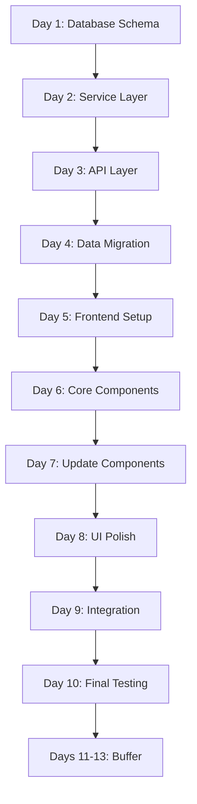

# Implementation Roadmap for Seat Classes

## Project Timeline: 9-13 Days

This roadmap provides a detailed, step-by-step guide for implementing seat classes in Galaxium Travels, with clear dependencies and milestones.

## Phase 1: Database & Backend Foundation (Days 1-3)

### Day 1: Database Schema Updates
**Goal:** Update database models and create migration strategy

#### Tasks
1. **Update models.py** (2 hours)
   - Add new columns to Flight model
   - Add new columns to Booking model
   - Add helper methods for seat class operations
   - Add validation logic

2. **Create migration script** (2 hours)
   - Write database migration functions
   - Add rollback capability
   - Test on development database

3. **Update db.py** (1 hour)
   - Ensure compatibility with new schema
   - Add any necessary initialization logic

4. **Testing** (3 hours)
   - Unit tests for model methods
   - Migration testing
   - Rollback testing
   - Data integrity validation

**Dependencies:** None
**Deliverables:** 
- Updated [`models.py`](galaxium-travels/booking_system_backend/models.py)
- Migration script
- Test suite for models

**Checkpoint:** Database schema successfully updated and tested

---

### Day 2: Backend Service Layer
**Goal:** Update service layer to handle seat classes

#### Tasks
1. **Update services/flight.py** (3 hours)
   - Modify `get_all_flights()` to return seat class info
   - Add seat class price calculation
   - Add seat availability checks per class

2. **Update services/booking.py** (4 hours)
   - Modify `book_flight()` to accept seat_class parameter
   - Update seat availability logic for specific classes
   - Modify `cancel_booking()` to restore correct class seats
   - Update `get_bookings()` to include seat class info

3. **Testing** (1 hour)
   - Unit tests for all service functions
   - Test each seat class booking
   - Test cancellation logic

**Dependencies:** Day 1 completed
**Deliverables:**
- Updated [`services/flight.py`](galaxium-travels/booking_system_backend/services/flight.py)
- Updated [`services/booking.py`](galaxium-travels/booking_system_backend/services/booking.py)
- Service layer tests

**Checkpoint:** Service layer handles seat classes correctly

---

### Day 3: API Layer & Schemas
**Goal:** Update API endpoints and Pydantic schemas

#### Tasks
1. **Update schemas.py** (2 hours)
   - Add new Pydantic models for seat classes
   - Update existing schemas
   - Add backward compatibility schemas

2. **Update server.py** (3 hours)
   - Modify existing endpoints
   - Add new `/seat-classes` endpoint
   - Ensure backward compatibility

3. **Error Handling** (1 hour)
   - Add new error codes
   - Update error responses
   - Test error scenarios

4. **Testing** (2 hours)
   - Integration tests for all endpoints
   - Test backward compatibility
   - API documentation updates

**Dependencies:** Days 1-2 completed
**Deliverables:**
- Updated [`schemas.py`](galaxium-travels/booking_system_backend/schemas.py)
- Updated [`server.py`](galaxium-travels/booking_system_backend/server.py)
- API integration tests

**Checkpoint:** Backend API fully supports seat classes

---

## Phase 2: Data Migration & Seeding (Day 4)

### Day 4: Seed Data & Migration
**Goal:** Update seed data and migrate existing data

#### Tasks
1. **Update seed.py** (3 hours)
   - Implement seat distribution logic
   - Add route type classification
   - Create flights with seat classes
   - Generate bookings with seat classes

2. **Run Migration** (1 hour)
   - Backup existing data
   - Run migration script
   - Verify data integrity

3. **Testing** (2 hours)
   - Verify seed data correctness
   - Test with both frontends
   - Validate pricing calculations

4. **Documentation** (2 hours)
   - Update API documentation
   - Document migration process
   - Create troubleshooting guide

**Dependencies:** Phase 1 completed
**Deliverables:**
- Updated [`seed.py`](galaxium-travels/booking_system_backend/seed.py)
- Migrated database
- Updated documentation

**Checkpoint:** Database populated with seat class data

---

## Phase 3: Frontend Development (Days 5-8)

### Day 5: Frontend Setup & Configuration
**Goal:** Set up new frontend project structure

#### Tasks
1. **Clone Frontend Project** (1 hour)
   - Copy booking_system_frontend to booking_system_frontend_classes
   - Update project name in package.json
   - Update configuration files

2. **Update Configuration** (2 hours)
   - Modify vite.config.ts for port 5174
   - Update environment variables
   - Configure build scripts

3. **Update TypeScript Types** (2 hours)
   - Add seat class types
   - Update Flight interface
   - Update Booking interface
   - Add new type definitions

4. **Update API Service** (3 hours)
   - Add seat class endpoints
   - Update existing API calls
   - Add error handling

**Dependencies:** Phase 2 completed
**Deliverables:**
- New frontend project at port 5174
- Updated type definitions
- Updated API service layer

**Checkpoint:** Frontend project configured and ready for development

---

### Day 6: Core Components Development
**Goal:** Create new seat class components

#### Tasks
1. **Create SeatClassCard Component** (3 hours)
   - Design component structure
   - Implement styling
   - Add interactions
   - Test component

2. **Create SeatClassSelector Component** (2 hours)
   - Implement selection logic
   - Add validation
   - Test component

3. **Create SeatClassBadge Component** (1 hour)
   - Design badge styles
   - Implement for each class
   - Test component

4. **Testing** (2 hours)
   - Unit tests for all components
   - Visual regression testing
   - Accessibility testing

**Dependencies:** Day 5 completed
**Deliverables:**
- SeatClassCard component
- SeatClassSelector component
- SeatClassBadge component
- Component tests

**Checkpoint:** Core seat class components completed

---

### Day 7: Update Existing Components
**Goal:** Integrate seat classes into existing components

#### Tasks
1. **Update FlightCard Component** (2 hours)
   - Add seat class display
   - Update pricing display
   - Test changes

2. **Update BookingModal Component** (3 hours)
   - Integrate SeatClassSelector
   - Update booking flow
   - Add price calculation
   - Test booking process

3. **Update BookingCard Component** (2 hours)
   - Add seat class badge
   - Display price paid
   - Test display

4. **Testing** (1 hour)
   - Integration testing
   - User flow testing
   - Cross-browser testing

**Dependencies:** Day 6 completed
**Deliverables:**
- Updated FlightCard
- Updated BookingModal
- Updated BookingCard
- Integration tests

**Checkpoint:** All components support seat classes

---

### Day 8: UI Polish & Optimization
**Goal:** Refine UI/UX and optimize performance

#### Tasks
1. **UI/UX Refinement** (3 hours)
   - Polish animations
   - Refine color schemes
   - Improve responsive design
   - Add loading states

2. **Performance Optimization** (2 hours)
   - Optimize re-renders
   - Add memoization
   - Lazy load components
   - Test performance

3. **Accessibility** (2 hours)
   - Add ARIA labels
   - Test keyboard navigation
   - Verify screen reader support
   - Check color contrast

4. **Testing** (1 hour)
   - E2E testing
   - Performance testing
   - Accessibility audit

**Dependencies:** Day 7 completed
**Deliverables:**
- Polished UI
- Optimized performance
- Accessible components
- E2E tests

**Checkpoint:** Frontend fully functional and polished

---

## Phase 4: Integration & Deployment (Days 9-10)

### Day 9: System Integration
**Goal:** Integrate all components and test end-to-end

#### Tasks
1. **Integration Testing** (3 hours)
   - Test complete booking flow
   - Test both frontends simultaneously
   - Test edge cases
   - Test error scenarios

2. **Update Startup Scripts** (2 hours)
   - Modify start.sh for both frontends
   - Modify start.bat for both frontends
   - Test startup process
   - Update documentation

3. **Documentation Updates** (3 hours)
   - Update README.md
   - Update DEVELOPER_GUIDE.md
   - Update API_REFERENCE.md
   - Create user guide

**Dependencies:** Phase 3 completed
**Deliverables:**
- Updated startup scripts
- Comprehensive documentation
- Integration test suite

**Checkpoint:** System fully integrated

---

### Day 10: Final Testing & Deployment Prep
**Goal:** Final validation and deployment preparation

#### Tasks
1. **Comprehensive Testing** (3 hours)
   - Full regression testing
   - Load testing
   - Security testing
   - User acceptance testing

2. **Bug Fixes** (3 hours)
   - Address any issues found
   - Verify fixes
   - Re-test affected areas

3. **Deployment Preparation** (2 hours)
   - Create deployment checklist
   - Prepare rollback plan
   - Document deployment steps
   - Final review

**Dependencies:** Day 9 completed
**Deliverables:**
- Test reports
- Bug fixes
- Deployment documentation
- Rollback plan

**Checkpoint:** System ready for deployment

---

## Phase 5: Buffer & Documentation (Days 11-13)

### Days 11-13: Buffer Time & Polish
**Goal:** Address any remaining issues and finalize documentation

#### Tasks
1. **Address Remaining Issues** (Variable)
   - Fix any outstanding bugs
   - Implement feedback
   - Optimize performance
   - Refine UI/UX

2. **Final Documentation** (Variable)
   - Complete all documentation
   - Create video tutorials (optional)
   - Prepare training materials
   - Update changelog

3. **Knowledge Transfer** (Variable)
   - Team training sessions
   - Code walkthrough
   - Q&A sessions
   - Handover documentation

**Dependencies:** Phase 4 completed
**Deliverables:**
- Production-ready system
- Complete documentation
- Training materials

**Checkpoint:** Project complete and ready for production

---

## Dependency Graph

## Critical Path

The critical path for this project is:
1. Database Schema (Day 1)
2. Service Layer (Day 2)
3. API Layer (Day 3)
4. Data Migration (Day 4)
5. Frontend Setup (Day 5)
6. Core Components (Day 6)
7. Update Components (Day 7)
8. Integration (Day 9)
9. Final Testing (Day 10)

**Total Critical Path Duration: 10 days**

## Risk Mitigation

### High-Risk Areas
1. **Database Migration** - Could corrupt data
   - Mitigation: Comprehensive backups, rollback plan, testing on dev environment

2. **Backward Compatibility** - Old frontend might break
   - Mitigation: Maintain deprecated fields, extensive testing, gradual rollout

3. **Concurrent Bookings** - Race conditions in seat availability
   - Mitigation: Database transactions, row-level locking, thorough testing

4. **Price Calculation Errors** - Incorrect pricing could cause issues
   - Mitigation: Comprehensive unit tests, validation logic, audit logging

### Medium-Risk Areas
1. **Frontend Performance** - New components might slow down UI
   - Mitigation: Performance testing, optimization, lazy loading

2. **User Experience** - Complex seat selection might confuse users
   - Mitigation: User testing, clear UI, helpful tooltips

## Success Metrics

### Technical Metrics
- [ ] All unit tests passing (>95% coverage)
- [ ] All integration tests passing
- [ ] API response time <200ms
- [ ] Frontend load time <2s
- [ ] Zero data corruption incidents

### Business Metrics
- [ ] Both frontends operational
- [ ] Seat class bookings working correctly
- [ ] Pricing calculations accurate
- [ ] User can complete booking in <2 minutes
- [ ] Zero critical bugs in production

## Rollback Plan

If critical issues arise:

1. **Immediate Rollback** (< 1 hour)
   - Revert to previous backend version
   - Disable new frontend
   - Restore database from backup

2. **Partial Rollback** (< 2 hours)
   - Keep backend changes
   - Disable seat class features
   - Use old frontend only

3. **Data Recovery** (< 4 hours)
   - Restore from backup
   - Replay transactions
   - Verify data integrity

## Communication Plan

### Daily Standups
- Progress updates
- Blocker identification
- Risk assessment

### Milestone Reviews
- End of each phase
- Stakeholder demos
- Feedback collection

### Final Presentation
- Complete feature demo
- Documentation review
- Training session

## Next Steps

1. **Review and approve this roadmap**
2. **Assign team members to tasks**
3. **Set up project tracking (Jira, Trello, etc.)**
4. **Begin Phase 1: Database & Backend Foundation**
5. **Schedule daily standups and milestone reviews**

---

**Note:** This roadmap assumes a single developer working full-time. With multiple developers, the timeline can be compressed by parallelizing independent tasks (e.g., frontend and backend development can happen simultaneously after Day 4).